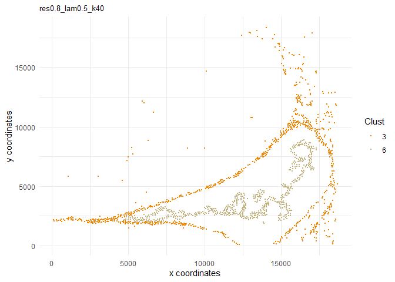

<!-- README.md is generated from README.Rmd. Please edit that file -->
<!-- badges: start -->

[](https://github.com/jleechung/Banksy/actions/workflows/R-CMD-check.yaml)
[](https://codecov.io/gh/jleechung/Banksy)
[](https://github.com/jleechung/Banksy/graphs/commit-activity)
<!-- badges: end -->

## Overview

BANKSY is a method for clustering spatial transcriptomic data by
augmenting the transcriptomic profile of each cell with an average of
the transcriptomes of its spatial neighbors. By incorporating
neighborhood information for clustering, BANKSY is able to

-   improve cell-type assignment in noisy data
-   distinguish subtly different cell-types stratified by
    microenvironment
-   identify spatial zones sharing the same microenvironment

BANKSY is applicable to a wide array of spatial technologies (e.g. 10x
Visium, Slide-seq, MERFISH) and scales well to large datasets. For more
details, check out the
[preprint](https://www.biorxiv.org/content/10.1101/2022.04.14.488259v1).
A gentle introduction to BANKSY is also available
[here](https://twitter.com/vipul1891/status/1515323372535644166?s=20&t=Bc6rz8VeWWptF67FejGYfQ)
as a tweetorial.

## Installation

The *Banksy* package can be installed via `remotes`:

``` r
remotes::install_github("prabhakarlab/Banksy", dependencies = TRUE)
```

## Documentation

Detailed description of *Banksy* functionality and example analyses are
available at the [package
webpage](https://prabhakarlab.github.io/Banksy/).

*Banksy* comes installed with
[documentation](https://prabhakarlab.github.io/Banksy/reference/index.html)
of main functions and their usage, along with several vignettes which
detail different use cases:

-   [Working with Banksy
    objects](https://prabhakarlab.github.io/Banksy/articles/banksy-object.html):
    Introduction to the *BanksyObject* class which serves as a container
    for *Banksy*.

-   [Mouse hippocampus VeraFISH
    dataset](https://prabhakarlab.github.io/Banksy/articles/hippocampus-analysis.html):
    Illustrates a grid search of parameters which best cluster cells.

-   [Human dorsolateral prefrontal cortex 10x Visium
    dataset](https://prabhakarlab.github.io/Banksy/articles/dlpfc-analysis.html):
    Illustrates analysis of multiple spatial transcriptomic datasets.

-   [Mouse hypothalamus MERFISH
    dataset](https://prabhakarlab.github.io/Banksy/articles/hypothalamus-analysis.html):
    Illustrates visualization functionality with a dataset with 3
    spatial dimensions.

-   [Interoperability with
    SingleCellExperiment](https://prabhakarlab.github.io/Banksy/articles/single-cell-exp.html):
    Illustrates BANKSY interoperability with the Bioconductor
    [SingleCellExperiment](https://bioconductor.org/packages/release/bioc/html/SingleCellExperiment.html)
    framework for interfacing with packages like
    [scran](https://bioconductor.org/packages/release/bioc/html/scran.html)
    or
    [scater](https://bioconductor.org/packages/release/bioc/html/scater.html).

## Quick start

*Banksy* takes as input an expression matrix and cell centroids. Example
datasets are provided with the package:

``` r
library(Banksy)

data(hippocampus)
expr <- hippocampus$expression
locs <- hippocampus$locations
```

The gene expression matrix for cells should be a `matrix`:

``` r
class(expr)
#> [1] "matrix" "array"
head(expr[,1:5])
#>         cell_1276 cell_8890 cell_691 cell_396 cell_9818
#> Sparcl1        45         0       11       22         0
#> Slc1a2         17         0        6        5         0
#> Map            10         0       12       16         0
#> Sqstm1         26         0        0        2         0
#> Atp1a2          0         0        4        3         0
#> Tnc             0         0        0        0         0
```

while cell locations should be supplied as a `data.frame`:

``` r
class(locs)
#> [1] "data.frame"
head(locs)
#>                 sdimx    sdimy
#> cell_1276  -13372.899 15776.37
#> cell_8890    8941.101 15866.37
#> cell_691   -14882.899 15896.37
#> cell_396   -15492.899 15835.37
#> cell_9818   11308.101 15846.37
#> cell_11310  14894.101 15810.37
```

We store the total counts for each cell and the number of expressed
genes as metadata `data.frame`, which can optionally be supplied:

``` r
total_count <- colSums(expr)
num_genes <- colSums(expr > 0)
meta <- data.frame(total_count = total_count, num_genes = num_genes)
```

Next, create a *BanksyObject* with the expression matrix and cell
locations (metadata is optional).

``` r
bank <- BanksyObject(own.expr = expr,
                     cell.locs = locs,
                     meta.data = meta)
```

Apply basic QC by keeping only cells with total counts within the 5th
and 98th percentile:

``` r
bank <- SubsetBanksy(bank, metadata = total_count > quantile(total_count, 0.05) &
                                      total_count < quantile(total_count, 0.98))
```

We first normalize the expression matrix, compute the neighbor matrix,
and scale the resulting matrices.

``` r
bank <- NormalizeBanksy(bank, normFactor = 100)
bank <- ComputeBanksy(bank, k_geom = 10, spatialMode = 'kNN_r')
#> Computing neighbors...
#> Computing neighbor matrix...
#> Done
bank <- ScaleBanksy(bank)
```

Run PCA on the BANKSY matrix for `lambda = 0` (no spatial information)
and `lambda = 0.3`.

``` r
bank <- RunPCA(bank, lambda = c(0, 0.3), npcs = 30)
#> Running PCA for lambda=0
#> Running PCA for lambda=0.3
```

Next, we obtain cluster assignments using graph-based clustering with
the Leiden algorithm on the first 20 PCs. Specify the following
parameters:

-   `resolution`. Leiden clustering resolution.  
-   `k.neighbours`. Number of k neighbours to use for constructing sNN.

``` r
set.seed(42)
bank <- ClusterBanksy(bank, lambda = c(0, 0.3), pca = TRUE, npcs = 20,
                      method = 'leiden', k.neighbors = 50, resolution = 1.2)
#> Iteration 1 out of 2
#> Iteration 2 out of 2
```

Different clustering runs can be harmonised with `ConnectClusters`:

``` r
bank <- ConnectClusters(bank, map.to = clust.names(bank)[1])
```

Visualise the clustering output for non-spatial clustering (`lambda=0`)
and BANKSY clustering (`lambda = 0.3`).

``` r
features <- clust.names(bank)
feature.types <- rep('discrete', 2)
main <- c('Non-spatial', 'BANKSY')
plotSpatialFeatures(bank, by = features, type = feature.types, main = main, 
                    pt.size = 1.5, main.size = 15, nrow = 1, ncol = 2)
```



For clarity, we can visualise each of the clusters separately with
`wrap = TRUE`:

``` r
plotSpatialFeatures(bank, by = features, type = feature.types, main = main, 
                    pt.size = 0.5, main.size = 15, nrow = 1, ncol = 2, 
                    wrap = TRUE)
```


## Contributing

Bug reports, questions, request for enhancements or other contributions
can be raised at the [issue
page](https://github.com/prabhakarlab/Banksy/issues).
