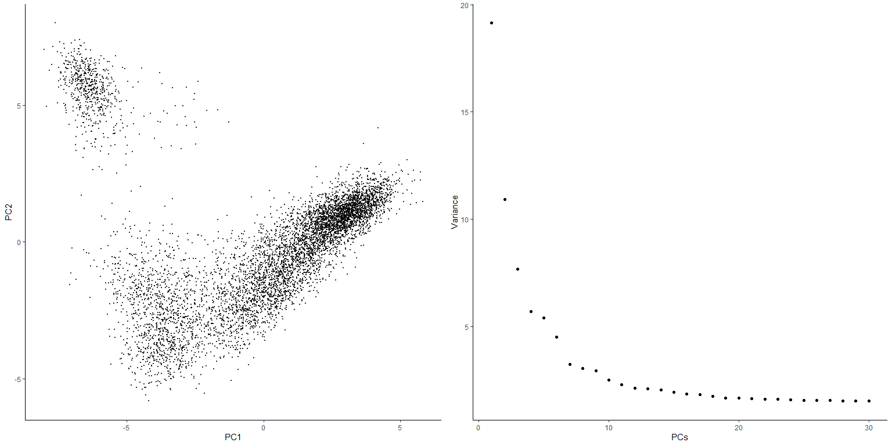

<!-- README.md is generated from README.Rmd. Please edit that file -->

## Overview

BANKSY is a method for clustering spatial omics data by augmenting the
features of each cell with both an average of the features of its
spatial neighbors along with neighborhood feature gradients. By
incorporating neighborhood information for clustering, BANKSY is able to

- improve cell-type assignment in noisy data
- distinguish subtly different cell-types stratified by microenvironment
- identify spatial domains sharing the same microenvironment

BANKSY is applicable to a wide array of spatial technologies (e.g. 10x
Visium, Slide-seq, MERFISH, CosMX, CODEX) and scales well to large
datasets. For more details, check out

- the
  [paper](https://www.nature.com/articles/s41588-024-01664-3),
- the [peer review file](https://static-content.springer.com/esm/art%3A10.1038%2Fs41588-024-01664-3/MediaObjects/41588_2024_1664_MOESM3_ESM.pdf)
- a
  [tweetorial](https://x.com/shyam_lab/status/1762648072360792479?s=20)
  on BANKSY,
- a set of [vignettes](https://prabhakarlab.github.io/Banksy) showing basic usage,
- a [Python version](https://github.com/prabhakarlab/Banksy_py) of this package,
- a [Zenodo archive](https://zenodo.org/records/10258795) containing scripts to reproduce the analyses in the paper, and the corresponding [GitHub Pages](https://github.com/jleechung/banksy-zenodo) (and [here](https://github.com/prabhakarlab/Banksy_py/tree/Banksy_manuscript) for analyses done in Python). 

## Installation

The *Banksy* package can be installed via:

``` r
BiocManager::install('Banksy')
```

To install from GitHub, use

``` r
remotes::install_github("prabhakarlab/Banksy")
```

*Banksy* is also interoperable with
[Seurat](https://satijalab.org/seurat/) via *SeuratWrappers*.
Documentation on how to run BANKSY on Seurat objects can be found
[here](https://github.com/jleechung/seurat-wrappers/blob/feat-aft/docs/banksy.md).
For installation of *SeuratWrappers* with BANKSY version `>= 0.1.4`, run

``` r
remotes::install_github('jleechung/seurat-wrappers@feat-aft')
```

## Quick start

Load *BANKSY*. We’ll also load *SpatialExperiment* and
*SummarizedExperiment* for containing and manipulating the data,
*scuttle* for normalization and quality control, and *scater*, *ggplot2*
and *cowplot* for visualisation.

``` r
library(Banksy)

library(SummarizedExperiment)
library(SpatialExperiment)
library(scuttle)

library(scater)
library(cowplot)
library(ggplot2)
```

Here, we’ll run *BANKSY* on mouse hippocampus data.

``` r
data(hippocampus)
gcm <- hippocampus$expression
locs <- as.matrix(hippocampus$locations)
```

Initialize a SpatialExperiment object and perform basic quality control
and normalization.

``` r
se <- SpatialExperiment(assay = list(counts = gcm), spatialCoords = locs)

# QC based on total counts
qcstats <- perCellQCMetrics(se)
thres <- quantile(qcstats$total, c(0.05, 0.98))
keep <- (qcstats$total > thres[1]) & (qcstats$total < thres[2])
se <- se[, keep]

# Normalization to mean library size
se <- computeLibraryFactors(se)
aname <- "normcounts"
assay(se, aname) <- normalizeCounts(se, log = FALSE)
```

Compute the neighborhood matrices for *BANKSY*. Setting
`compute_agf=TRUE` computes both the weighted neighborhood mean
($\mathcal{M}$) and the azimuthal Gabor filter ($\mathcal{G}$). The
number of spatial neighbors used to compute $\mathcal{M}$ and
$\mathcal{G}$ are `k_geom[1]=15` and `k_geom[2]=30` respectively. We run
*BANKSY* at `lambda=0` corresponding to non-spatial clustering, and
`lambda=0.2` corresponding to *BANKSY* for cell-typing.

``` r
lambda <- c(0, 0.2)
k_geom <- c(15, 30)

se <- Banksy::computeBanksy(se, assay_name = aname, compute_agf = TRUE, k_geom = k_geom)
#> Computing neighbors...
#> Spatial mode is kNN_median
#> Parameters: k_geom=15
#> Done
#> Computing neighbors...
#> Spatial mode is kNN_median
#> Parameters: k_geom=30
#> Done
#> Computing harmonic m = 0
#> Using 15 neighbors
#> Done
#> Computing harmonic m = 1
#> Using 30 neighbors
#> Centering
#> Done
```

Next, run PCA on the BANKSY matrix and perform clustering. Setting
`use_agf=TRUE` uses both $\mathcal{M}$ and $\mathcal{G}$ to construct
the BANKSY matrix.

``` r
set.seed(1000)
se <- Banksy::runBanksyPCA(se, use_agf = TRUE, lambda = lambda)
se <- Banksy::runBanksyUMAP(se, use_agf = TRUE, lambda = lambda)
se <- Banksy::clusterBanksy(se, use_agf = TRUE, lambda = lambda, resolution = 1.2)
```

Different clustering runs can be relabeled to minimise their differences
with `connectClusters`:

``` r
se <- Banksy::connectClusters(se)
#> clust_M1_lam0.2_k50_res1.2 --> clust_M1_lam0_k50_res1.2
```

Visualise the clustering output for non-spatial clustering (`lambda=0`)
and BANKSY clustering (`lambda=0.2`).

``` r
cnames <- colnames(colData(se))
cnames <- cnames[grep("^clust", cnames)]
colData(se) <- cbind(colData(se), spatialCoords(se))

plot_nsp <- plotColData(se,
    x = "sdimx", y = "sdimy",
    point_size = 0.6, colour_by = cnames[1]
)
plot_bank <- plotColData(se,
    x = "sdimx", y = "sdimy",
    point_size = 0.6, colour_by = cnames[2]
)


plot_grid(plot_nsp + coord_equal(), plot_bank + coord_equal(), ncol = 2)
```



For clarity, we can visualise each of the clusters separately:

``` r
plot_grid(
    plot_nsp + facet_wrap(~colour_by),
    plot_bank + facet_wrap(~colour_by),
    ncol = 2
)
```


Visualize UMAPs of the non-spatial and BANKSY embedding:

``` r
rdnames <- reducedDimNames(se)

umap_nsp <- plotReducedDim(se,
    dimred = grep("UMAP.*lam0$", rdnames, value = TRUE),
    colour_by = cnames[1]
)
umap_bank <- plotReducedDim(se,
    dimred = grep("UMAP.*lam0.2$", rdnames, value = TRUE),
    colour_by = cnames[2]
)
plot_grid(
    umap_nsp,
    umap_bank,
    ncol = 2
)
```


<details>
<summary>
Runtime for analysis
</summary>

    #> Time difference of 56.68255 secs

</details>
<details>
<summary>
Session information
</summary>

``` r
sessionInfo()
#> R version 4.3.2 (2023-10-31)
#> Platform: aarch64-apple-darwin20 (64-bit)
#> Running under: macOS Sonoma 14.2.1
#> 
#> Matrix products: default
#> BLAS:   /Library/Frameworks/R.framework/Versions/4.3-arm64/Resources/lib/libRblas.0.dylib 
#> LAPACK: /Library/Frameworks/R.framework/Versions/4.3-arm64/Resources/lib/libRlapack.dylib;  LAPACK version 3.11.0
#> 
#> locale:
#> [1] en_US.UTF-8/en_US.UTF-8/en_US.UTF-8/C/en_US.UTF-8/en_US.UTF-8
#> 
#> time zone: Europe/London
#> tzcode source: internal
#> 
#> attached base packages:
#> [1] stats4    stats     graphics  grDevices utils     datasets  methods  
#> [8] base     
#> 
#> other attached packages:
#>  [1] cowplot_1.1.1               scater_1.30.0              
#>  [3] ggplot2_3.4.4               scuttle_1.12.0             
#>  [5] SpatialExperiment_1.12.0    SingleCellExperiment_1.24.0
#>  [7] SummarizedExperiment_1.32.0 Biobase_2.62.0             
#>  [9] GenomicRanges_1.54.1        GenomeInfoDb_1.38.1        
#> [11] IRanges_2.36.0              S4Vectors_0.40.1           
#> [13] BiocGenerics_0.48.1         MatrixGenerics_1.14.0      
#> [15] matrixStats_1.1.0           Banksy_0.99.2              
#> 
#> loaded via a namespace (and not attached):
#>  [1] tidyselect_1.2.0          viridisLite_0.4.2        
#>  [3] farver_2.1.1              dplyr_1.1.3              
#>  [5] vipor_0.4.5               viridis_0.6.4            
#>  [7] bitops_1.0-7              fastmap_1.1.1            
#>  [9] RCurl_1.98-1.13           digest_0.6.33            
#> [11] rsvd_1.0.5                lifecycle_1.0.4          
#> [13] magrittr_2.0.3            dbscan_1.1-11            
#> [15] compiler_4.3.2            rlang_1.1.2              
#> [17] tools_4.3.2               igraph_1.5.1             
#> [19] utf8_1.2.4                yaml_2.3.7               
#> [21] data.table_1.14.8         knitr_1.45               
#> [23] labeling_0.4.3            S4Arrays_1.2.0           
#> [25] mclust_6.0.0              DelayedArray_0.28.0      
#> [27] abind_1.4-5               BiocParallel_1.36.0      
#> [29] withr_2.5.2               grid_4.3.2               
#> [31] fansi_1.0.5               beachmat_2.18.0          
#> [33] colorspace_2.1-0          aricode_1.0.3            
#> [35] scales_1.2.1              cli_3.6.1                
#> [37] rmarkdown_2.25            crayon_1.5.2             
#> [39] leidenAlg_1.1.2           generics_0.1.3           
#> [41] rstudioapi_0.15.0         rjson_0.2.21             
#> [43] DelayedMatrixStats_1.24.0 ggbeeswarm_0.7.2         
#> [45] RcppHungarian_0.3         zlibbioc_1.48.0          
#> [47] parallel_4.3.2            XVector_0.42.0           
#> [49] vctrs_0.6.4               Matrix_1.6-1.1           
#> [51] BiocSingular_1.18.0       BiocNeighbors_1.20.0     
#> [53] ggrepel_0.9.4             irlba_2.3.5.1            
#> [55] beeswarm_0.4.0            magick_2.8.1             
#> [57] glue_1.6.2                codetools_0.2-19         
#> [59] uwot_0.1.16               RcppAnnoy_0.0.21         
#> [61] gtable_0.3.4              ScaledMatrix_1.10.0      
#> [63] munsell_0.5.0             tibble_3.2.1             
#> [65] pillar_1.9.0              htmltools_0.5.7          
#> [67] GenomeInfoDbData_1.2.11   R6_2.5.1                 
#> [69] sparseMatrixStats_1.14.0  evaluate_0.23            
#> [71] sccore_1.0.4              lattice_0.22-5           
#> [73] highr_0.10                Rcpp_1.0.11              
#> [75] gridExtra_2.3             SparseArray_1.2.2        
#> [77] xfun_0.41                 pkgconfig_2.0.3
```

</details>
