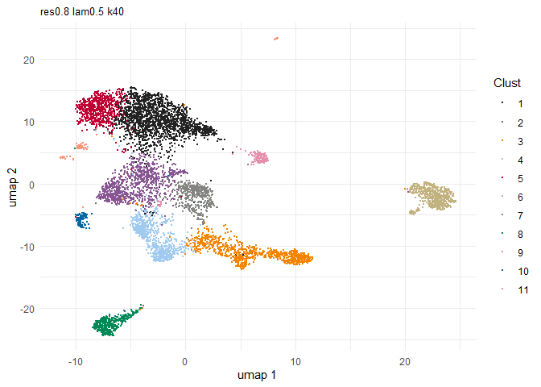
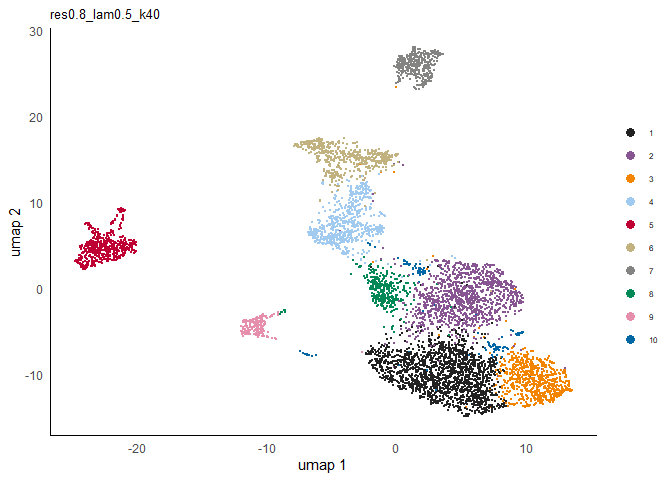

<!-- README.md is generated from README.Rmd. Please edit that file -->

# Banksy

<!-- badges: start -->

<!-- badges: end -->

Banksy is an R packaged that incorporates spatial information to cluster
cells in a feature space (e.g. gene expression). Spatial information is
incorporated by averaging the features of the k nearest neighbours to
generate new ‘neighbour’ features for a given cell. This is concatenated
to the cell’s own features to generate a combined feature matrix which
is used for constructing a nearest neighbour network. Leiden clustering
is used to obtain spatially-informed clusters.

## Installation

``` r
remotes::install_github("jleechung/Banksy")
```

Load the package:

``` r
library(Banksy)
```

## Quick Start

### Input data

Inputs consist of an expression matrix and cell locations. Sample data
provided with the
package:

``` r
expr <- readRDS(system.file('/extdata/expression.rds', package = 'Banksy'))
locs <- readRDS(system.file('/extdata/locations.rds', package = 'Banksy'))
```

The gene expression matrix for cells should either be a `data.frame` or
sparse matrix of class `dgCMatrix`:

``` r
head(expr[,1:5])
#>          cell_4 cell_5 cell_6 cell_7 cell_8
#> Slc1a2        4      2     13     26      6
#> Scn4b         3      6     17      0      1
#> Itpr1         3      0     15      2      3
#> Slc25a23      3      0      5      3      1
#> Slc1a3        1      1      0     31      2
#> Nfib          1      1      1      4      0
```

The locations of each cell as a `data.frame`:

``` r
head(locs)
#>            sdimx     sdimy
#> cell_4  68.49701 13951.186
#> cell_5  73.80242 18085.385
#> cell_6 119.55364  3143.897
#> cell_7 105.25295  2191.132
#> cell_8  96.64224  4806.681
#> cell_9 110.59598 14124.008
```

### Spatial clustering

First, create a *BanksyObject* with the expression matrix and cell
locations.

``` r
bank <- BanksyObject(own.expr = expr,
                     cell.locs = locs)
```

Compute the neighbour matrix, and scale and normalize matrix. The
options below are defaults and listed for clarity.

``` r
bank <- ComputeBanksy(bank,
                      normalizeColumns = TRUE,
                      normalizeColumnsTo = 100,
                      zScaleRows = TRUE,
                      zScaleBeforeAveraging = FALSE,
                      zScaleOwnAfterAveraging = TRUE,
                      zScaleNbrAfterAveraging = TRUE)
#> Performing normalization...
#> Computing Banksy matrices...
#> Spatial mode is kNN_r, k_geom = 10
#> Banksy matrix: 75.37 sec elapsed
```

Obtain clusters for selected parameters.

  - `lambda` \(\in[0,1]\). A mixing parameter which determines how much
    spatial information is incorporated.  
  - `resolution`. Leiden clustering resolution.  
  - `kneighbours`. Number of k neighbours to use for constructing sNN.

<!-- end list -->

``` r
bank <- ClusterBanksy(bank, lambda = 0.25,
                            resolution = 1.2,
                            kneighbours = 30)
#> 
#>  external python path provided and will be used
#> Iteration 1 out of 1
#> Consider to install these (optional) packages to run all possible Giotto commands:  RTriangle FactoMiner
#>  Giotto does not automatically install all these packages as they are not absolutely required and this reduces the number of dependencieshvg  was not found in the gene metadata information, all genes will be used
#> Finished clustering for Lambda=0.25, Resolution=1.2, K Neighbours=30
#> 35.895 sec elapsed
```

### Visualization

UMAP visualization:

``` r
plotUMAP(bank, params = 'res1.2_lam0.25_k30', size = 0.02)
```



Spatial plot:

``` r
plotSpatialDims(bank, params = 'res1.2_lam0.25_k30', size = 0.02)
```



## Session information

``` r
sessionInfo()
#> R version 3.6.0 (2019-04-26)
#> Platform: x86_64-pc-linux-gnu (64-bit)
#> Running under: Ubuntu 18.04.2 LTS
#> 
#> Matrix products: default
#> BLAS:   /usr/lib/x86_64-linux-gnu/blas/libblas.so.3.7.1
#> LAPACK: /usr/lib/x86_64-linux-gnu/lapack/liblapack.so.3.7.1
#> 
#> locale:
#> [1] C
#> 
#> attached base packages:
#> [1] stats     graphics  grDevices utils     datasets  methods   base     
#> 
#> other attached packages:
#> [1] Banksy_0.99.0
#> 
#> loaded via a namespace (and not attached):
#>  [1] reticulate_1.14    tidyselect_0.2.5   xfun_0.12          purrr_0.3.3       
#>  [5] lattice_0.20-38    Giotto_1.0.2       colorspace_1.4-1   htmltools_0.4.0   
#>  [9] yaml_2.2.0         rlang_0.4.4        pracma_2.3.3       pillar_1.4.1      
#> [13] glue_1.3.1         rappdirs_0.3.1     uwot_0.1.5         RColorBrewer_1.1-2
#> [17] lifecycle_0.1.0    plyr_1.8.5         stringr_1.4.0      tictoc_1.0.1      
#> [21] munsell_0.5.0      gtable_0.3.0       codetools_0.2-16   evaluate_0.14     
#> [25] labeling_0.3       knitr_1.27         irlba_2.3.3        parallel_3.6.0    
#> [29] Rcpp_1.0.5         scales_1.1.0       dbscan_1.1-5       RcppParallel_4.4.4
#> [33] jsonlite_1.6       farver_2.0.3       RSpectra_0.16-0    ggplot2_3.3.2     
#> [37] digest_0.6.19      stringi_1.4.5      dplyr_0.8.4        ggrepel_0.8.1     
#> [41] cowplot_1.0.0      grid_3.6.0         tools_3.6.0        magrittr_1.5      
#> [45] RcppAnnoy_0.0.14   tibble_2.1.3       crayon_1.3.4       pkgconfig_2.0.2   
#> [49] Matrix_1.2-17      data.table_1.12.8  assertthat_0.2.1   rmarkdown_2.1     
#> [53] R6_2.4.0           igraph_1.2.4.2     compiler_3.6.0
```
