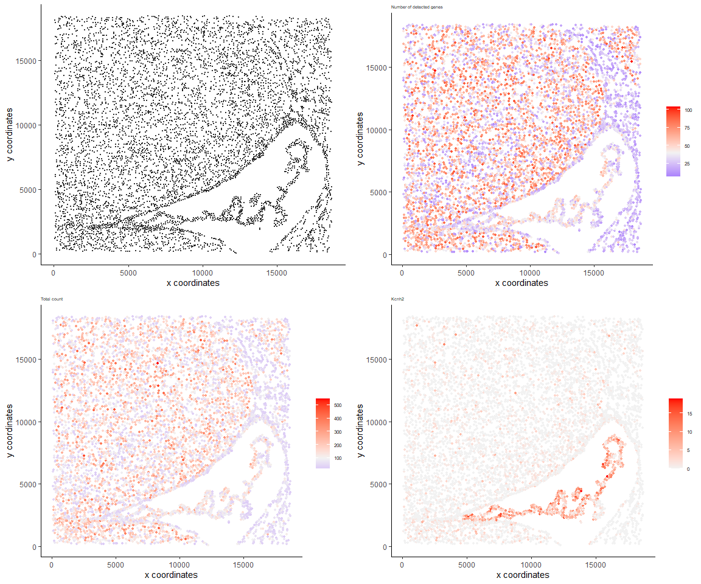
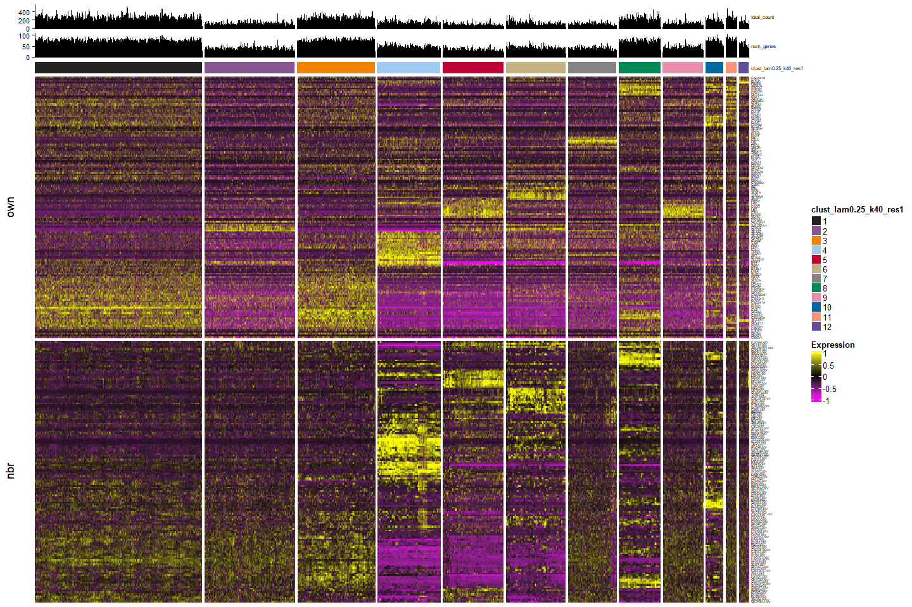

<!-- README.md is generated from README.Rmd. Please edit that file -->

# Banksy

<!-- badges: start -->

<!-- badges: end -->

Banksy is an R package that incorporates spatial information to cluster
cells in a feature space (e.g. gene expression). Spatial information is
incorporated by averaging the features of the k nearest neighbours to
generate new ‘neighbour’ features for a given cell. This is concatenated
to the cell’s own features to generate a combined feature matrix which
is used for constructing a nearest neighbour network. Leiden clustering
is used to obtain spatially-informed clusters.

# Installation

``` r
# Install from GitHub
remotes::install_github("jleechung/Banksy", dependencies = TRUE)
```

# Documentation

NOTE: These links will not work at the moment since the repo is still
private. Refer to the
[vignettes](https://github.com/jleechung/Banksy/tree/main/vignettes) for
the time being.

*Banksy* comes installed with
[documentation](https://jleechung.github.io/Banksy/reference/index.html)
of main functions and their usage, along with several vignettes which
detail different use cases:

  - [Working with Banksy
    objects](https://jleechung.github.io/Banksy/articles/banksy-object.html):
    Introduction to the *BanksyObject* class which serves as a container
    for *Banksy*.

  - [Finding optimal clustering
    parameters](https://jleechung.github.io/Banksy/articles/grid-search.html):
    Illustrates a grid search of parameters which best cluster cells.

  - [Analysing multiple
    datasets](https://jleechung.github.io/Banksy/articles/multiple-datasets.html):
    Illustrates analysis of multiple spatial transcriptomic datasets.

  - [Integrating *Banksy* with other
    packages](https://jleechung.github.io/Banksy/articles/integrating-pkgs.html):
    Illustrates how users can integrate *Banksy* with packages like
    *Seurat* and *Giotto*.

# Basic Usage

## Input data

Inputs consist of an expression matrix and cell locations. Sample data
is provided with the package:

``` r
library(Banksy)

expr <- readRDS(system.file('/extdata/expression.rds', package = 'Banksy'))
locs <- readRDS(system.file('/extdata/locations.rds', package = 'Banksy'))
```

The gene expression matrix for cells should be a `matrix`:

``` r
class(expr)
#> [1] "matrix" "array"
head(expr[,1:5])
#>          cell_4 cell_5 cell_6 cell_7 cell_8
#> Slc1a2        4      2     13     26      6
#> Scn4b         3      6     17      0      1
#> Itpr1         3      0     15      2      3
#> Slc25a23      3      0      5      3      1
#> Slc1a3        1      1      0     31      2
#> Nfib          1      1      1      4      0
```

while cell locations should be supplied as a `data.frame`:

``` r
class(locs)
#> [1] "data.frame"
head(locs)
#>            sdimx     sdimy
#> cell_4  68.49701 13951.186
#> cell_5  73.80242 18085.385
#> cell_6 119.55364  3143.897
#> cell_7 105.25295  2191.132
#> cell_8  96.64224  4806.681
#> cell_9 110.59598 14124.008
```

We store the total number of detect genes and total counts as metadata:

``` r
metadata <- data.frame(num_genes = colSums(expr > 0),
                       total_count = colSums(expr))
```

Next, create a *BanksyObject* with the expression matrix and cell
locations.

``` r
bank <- BanksyObject(own.expr = expr,
                     cell.locs = locs,
                     meta.data = metadata)
```

We can visualize the spatial layout of the cells, number of detected
genes, total count, and the expression of specific genes:

``` r
p1 <- plotSpatialDims(bank)
p2 <- plotSpatialDims(bank, by = 'num_genes', type = 'continuous', pt.size = 1, pt.alpha = 1, main = 'Number of detected genes')
p3 <- plotSpatialDims(bank, by = 'total_count', type = 'continuous', pt.size = 1, pt.alpha = 1, main = 'Total count')
p4 <- plotSpatialDims(bank, by = 'Kcnh2', type = 'continuous', pt.size = 1, pt.alpha = 1, main = 'Kcnh2')
gridExtra::grid.arrange(p1, p2, p3, p4, nrow = 2, ncol = 2)
```



## Spatial clustering

We first normalize the expression matrix, compute the neighbour matrix,
and scale the resulting gene-cell and neighbour feature-cell matrix.

``` r
bank <- NormalizeBanksy(bank, normFactor = 100)
bank <- ComputeBanksy(bank)
#> Computing neighbors...
#> Computing neighbor matrix...
#> Done
bank <- ScaleBanksy(bank)
```

At this point, the joint expression matrix (gene-cell matrix and
neighbour feature-cell matrix) can be extracted with *getBanksyMatrix*,
which returns the joint matrix and cell locations:

``` r
joint <- getBanksyMatrix(bank, lambda = 0.25)

joint$expr[1:5,1:5]
#>              cell_4      cell_5     cell_6     cell_7     cell_8
#> Slc1a2   0.41040297 -0.36165667 -0.4364615  0.8607711  0.3392922
#> Scn4b    0.85950683  2.02739671  0.2884143 -0.7755390 -0.4313188
#> Itpr1    0.77398900 -1.00281439  0.0173598 -0.7598327  0.1193772
#> Slc25a23 2.51032763 -1.15087647 -0.4501676 -0.3998602 -0.3800967
#> Slc1a3   0.07620877 -0.01765429 -0.5808326  3.5972767  0.2491144
joint$locs[1:5,]
#>            sdimx     sdimy
#> cell_4  68.49701 13951.186
#> cell_5  73.80242 18085.385
#> cell_6 119.55364  3143.897
#> cell_7 105.25295  2191.132
#> cell_8  96.64224  4806.681
```

Run PCA on the Banksy matrix. We set `lambda=0.25`. This populates the
`reduction` slot:

``` r
lambda <- 0.25
bank <- RunPCA(bank, lambda = lambda, npcs = 30)
#> Running PCA for lambda=0.25
names(bank@reduction)
#> [1] "pca_0.25"
```

Visualize PCA and its scree plot:

``` r
p1 <- plotReduction(bank, reduction = 'pca_0.25')
p2 <- plotScree(bank, lambda = lambda)
gridExtra::grid.arrange(p1, p2, ncol = 2)
```


For visualization, we run UMAP on 30 principal components:

``` r
bank <- RunUMAP(bank, lambda = lambda, npcs = 30)
#> Computing UMAP with 30 PCs
#> Running UMAP for lambda=0.25
```

Next, we obtain cluster assignments for the following parameters:

  - `lambda`. A mixing parameter from 0 to 1 which determines how much
    spatial information is incorporated.  
  - `resolution`. Leiden clustering resolution.  
  - `kneighbours`. Number of k neighbours to use for constructing sNN.

<!-- end list -->

``` r
set.seed(1234)
bank <- ClusterBanksy(bank, lambda = lambda, method = 'leiden',
                      k.neighbors = 40, resolution = 0.8)
#> Iteration 1 out of 1
```

## Visualization

We can visualize the UMAP and spatial plots by the clustering run:

``` r
run <-  'clust_lam0.25_k40_res0.8'
plotReduction(bank, reduction = 'umap_0.25', by = run, type = 'discrete', pt.size = 0.02)
```


``` r
plotSpatialDims(bank, by = run, type = 'discrete', pt.size = 0.8)
```


Heatmap of the cells, annotated by the clustering run with barplots of
the number of detected genes and total count:

``` r
plotHeatmap(bank, assay = 'banksy',
            lambda = lambda,
            annotate = TRUE,
            annotate.by = run,
            barplot.by = c('num_genes', 'total_count'))
#> `use_raster` is automatically set to TRUE for a matrix with more than
#> 2000 columns You can control `use_raster` argument by explicitly
#> setting TRUE/FALSE to it.
#> 
#> Set `ht_opt$message = FALSE` to turn off this message.
```



# Session information

``` r
sessionInfo()
#> R version 4.0.3 (2020-10-10)
#> Platform: x86_64-w64-mingw32/x64 (64-bit)
#> Running under: Windows 10 x64 (build 19043)
#> 
#> Matrix products: default
#> 
#> locale:
#> [1] LC_COLLATE=English_Singapore.1252  LC_CTYPE=English_Singapore.1252   
#> [3] LC_MONETARY=English_Singapore.1252 LC_NUMERIC=C                      
#> [5] LC_TIME=English_Singapore.1252    
#> 
#> attached base packages:
#> [1] stats     graphics  grDevices utils     datasets  methods   base     
#> 
#> other attached packages:
#> [1] Banksy_0.1.0
#> 
#> loaded via a namespace (and not attached):
#>  [1] maps_3.3.0               RcppHungarian_0.1        assertthat_0.2.1        
#>  [4] highr_0.9                stats4_4.0.3             yaml_2.2.1              
#>  [7] pillar_1.6.2             lattice_0.20-41          glue_1.4.2              
#> [10] RcppEigen_0.3.3.9.1      digest_0.6.27            RColorBrewer_1.1-2      
#> [13] colorspace_2.0-2         htmltools_0.5.1.1        Matrix_1.3-4            
#> [16] plyr_1.8.6               pkgconfig_2.0.3          GetoptLong_1.0.5        
#> [19] magick_2.7.2             purrr_0.3.4              scales_1.1.1            
#> [22] sccore_0.1.3             RSpectra_0.16-0          leidenAlg_0.1.1         
#> [25] ggalluvial_0.12.3        collapse_1.6.5           tibble_3.1.3            
#> [28] generics_0.1.0           dbscan_1.1-8             farver_2.1.0            
#> [31] IRanges_2.24.1           grr_0.9.5                ggplot2_3.3.5           
#> [34] ellipsis_0.3.2           BiocGenerics_0.36.1      magrittr_2.0.1          
#> [37] crayon_1.4.1             mclust_5.4.7             evaluate_0.14           
#> [40] fansi_0.5.0              RcppArmadillo_0.10.6.0.0 Cairo_1.5-12.2          
#> [43] tools_4.0.3              data.table_1.14.0        GlobalOptions_0.1.2     
#> [46] lifecycle_1.0.0          matrixStats_0.60.0       ComplexHeatmap_2.6.2    
#> [49] stringr_1.4.0            S4Vectors_0.28.1         munsell_0.5.0           
#> [52] cluster_2.1.2            irlba_2.3.3              compiler_4.0.3          
#> [55] rlang_0.4.11             grid_4.0.3               Matrix.utils_0.9.8      
#> [58] dichromat_2.0-0          RcppAnnoy_0.0.19         rjson_0.2.20            
#> [61] circlize_0.4.13          igraph_1.2.6             labeling_0.4.2          
#> [64] rmarkdown_2.10           codetools_0.2-16         gtable_0.3.0            
#> [67] DBI_1.1.1                R6_2.5.1                 gridExtra_2.3           
#> [70] knitr_1.33               dplyr_1.0.7              uwot_0.1.10             
#> [73] utf8_1.2.2               zeallot_0.1.0            clue_0.3-59             
#> [76] pals_1.7                 shape_1.4.6              stringi_1.7.3           
#> [79] parallel_4.0.3           Rcpp_1.0.7               vctrs_0.3.8             
#> [82] mapproj_1.2.7            png_0.1-7                tidyselect_1.1.1        
#> [85] xfun_0.25
```
