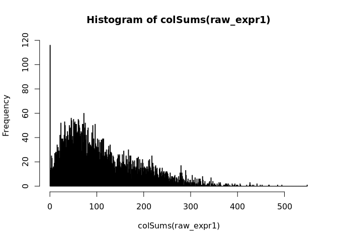

<!-- README.md is generated from README.Rmd. Please edit that file -->

# Banksy

<!-- badges: start -->

<!-- badges: end -->

Banksy is an R packaged that incorporates spatial information to cluster
cells in a feature space (e.g. gene expression). Spatial information is
incorporated by averaging the features of the k nearest neighbours to
generate new ‘neighbour’ features for a given cell. This is concatenated
to the cell’s own features to generate a combined feature matrix which
is used for constructing a nearest neighbour network. Leiden clustering
is used to obtain spatially-informed clusters.

## Installation

``` r
remotes::install_github("jleechung/Banksy")
```

Load the package:

``` r
library(Banksy)
```

## Dataset

Data is a gene-cell matrix (gcm) with spatial locations appended:

``` r
## Generate the raw counts matrix - 7250 cells
all_data1 <- read.csv(system.file('extdata/cellmtx.csv', package = 'Banksy'), 
                     row.names = 'geneName')
```

Dimensions:

``` r
dim(all_data1)
#> [1]  143 7250
```

``` r
head(all_data1[,1:5])
#>          cellID_4 cellID_5 cellID_6 cellID_7 cellID_8
#> Slc1a2          4        2       13       26        6
#> Scn4b           3        6       17        0        1
#> Itpr1           3        0       15        2        3
#> Slc25a23        3        0        5        3        1
#> Slc1a3          1        1        0       31        2
#> Nfib            1        1        1        4        0
```

``` r
tail(all_data1[,1:5])
#>              cellID_4    cellID_5   cellID_6  cellID_7    cellID_8
#> Thbs1         0.00000     0.00000     1.0000     0.000     0.00000
#> Grik4         0.00000     0.00000     0.0000     1.000     0.00000
#> Cd274         0.00000     0.00000     0.0000     0.000     0.00000
#> CentroidX    68.49701    73.80242   119.5536   105.253    96.64224
#> CentroidY 13951.18570 18085.38482  3143.8967  2191.132  4806.68051
#> CellArea  20796.00000 10789.00000 32277.0000 18288.000 22976.00000
```

Pre-processing:

``` r
## Clean colnames
cellNames1 <- colnames(all_data1)
cellNames <- gsub(pattern = 'cellID_', replacement = 'cell_', cellNames1)
colnames(all_data1) = cellNames

## Remove spatial location data
raw_expr1 <- all_data1[1:(nrow(all_data1)-3),]

hist(colSums(raw_expr1), breaks = 500)
```



Filter cells with total expression less than 20:

``` r
## 6725 cells after filtering
filtered_cells <- colSums(raw_expr1)>=20
all_data <- all_data1[,filtered_cells]

## we must always filter out cells with zero expression. otherwise the normalization gives NaNs
raw_expr <- all_data[1:(nrow(all_data)-3),]
```

Spatial information:

``` r
cell_locs <- all_data[c('CentroidX', 'CentroidY'), ]
rownames(cell_locs) <- c('sdimx', 'sdimy')
cell_locs <- t(cell_locs)
cell_area <- all_data['CellArea',]
head(cell_locs)
#>            sdimx     sdimy
#> cell_4  68.49701 13951.186
#> cell_5  73.80242 18085.385
#> cell_6 119.55364  3143.897
#> cell_7 105.25295  2191.132
#> cell_8  96.64224  4806.681
#> cell_9 110.59598 14124.008
```

## Run

Define parameters (change as required):

``` r
## Normalization
normalizeColumns <- TRUE
scaleFactor <- 100

## Zscaling
zScaleRows <- TRUE
zScaleBeforeAveraging <- FALSE
zScaleOwnAfterAveraging <- TRUE
zScaleNbrAfterAveraging <- TRUE

## Number of clustering iterations 
## Negative: run until no improvementis reached
lieden_iters <- -1

## Python path
my_python_path <- "/usr/bin/python3"

## Use these lines to subset the data spatially.
## -100000 to 100000 in both x and y for example basically means no subsetting
xlower <- 0
ylower <- 0
xupper <- 60000
yupper <- 60000

## Parameters for clustering
sigma <- 1.5
lambda <- 0   ## Mixing parameter
alpha <- 0.05
pcs <- 15     ## Number of PCs
ki <- 30  
res <- 1.2    ## Resolution
KNN_k <- 7    ## Number of neighbours
use_docker <- TRUE

## Parameters for sweeping
colparam <- 'lam'
rowparam <- 'res'
rowvalues <- c(0.5, 0.75)
colvalues <- c(0, 0.25, 0.5)

## Parameters for connecting
rootNode <- c(1,3)
```

Create Giotto object:

``` r
instrs = createGiottoInstructions(python_path = my_python_path,
                                show_plot = FALSE,
                                return_plot = TRUE,
                                save_plot = TRUE,
                                save_dir = '/data',
                                plot_format = 'png',
                                dpi = 300,
                                height = 9, width = 9,
                                is_docker = use_docker)
#> 
#>  external python path provided and will be used

go_testx <- createGiottoObject(raw_exprs = raw_expr,
                             spatial_locs = cell_locs,
                             instructions = instrs)
#> Consider to install these (optional) packages to run all possible Giotto commands:  RTriangle FactoMiner
#>  Giotto does not automatically install all these packages as they are not absolutely required and this reduces the number of dependencies

go_testx <- normalizeGiotto(gobject = go_testx,
                          scalefactor = scaleFactor,  library_size_norm = FALSE,
                          verbose = F, log_norm = FALSE, scale_cells = FALSE, scale_genes = FALSE)

go_exprs1 <- go_testx@raw_exprs #go_testx@norm_scaled_expr #

celllocations1 = go_testx@spatial_locs
celllocations = celllocations1[celllocations1$sdimx<xupper & celllocations1$sdimx>xlower
                             &celllocations1$sdimy>ylower & celllocations1$sdimy<yupper,]

cellID_2use <- intersect(colnames(go_exprs1), celllocations$cell_ID)
go_locs_all_cols = celllocations[celllocations$cell_ID %in% cellID_2use,]
go_exprs_counts = go_exprs1[rownames(go_exprs1), colnames(go_exprs1)[colnames(go_exprs1) %in% cellID_2use]]
```

Inputs:

  - gene-cell matrix (sparse matrix)  
  - cell locations (data.table)

<!-- end list -->

``` r
go_locs_all_cols
#>             sdimx     sdimy   cell_ID
#>    1:    68.49701 13951.186    cell_4
#>    2:    73.80242 18085.385    cell_5
#>    3:   119.55364  3143.897    cell_6
#>    4:   105.25295  2191.132    cell_7
#>    5:    96.64224  4806.681    cell_8
#>   ---                                
#> 6721: 18649.84113  2438.176 cell_7241
#> 6722: 18646.54509 11721.497 cell_7242
#> 6723: 18634.19469  3411.023 cell_7245
#> 6724: 18656.99013  5211.892 cell_7251
#> 6725: 18677.24526  4319.682 cell_7255
```

Call to `RunBanksy`:

``` r
clustresults <- RunBanksy(gcm = go_exprs_counts,
                          locs = go_locs_all_cols,
                          normalizeColumns = normalizeColumns,
                          normalizeColumnsTo = scaleFactor,
                          lieden_iters = lieden_iters,
                          sigma = sigma, lambda = lambda, alpha = alpha,
                          zScaleRows = zScaleRows,
                          zScaleBeforeAveraging = zScaleBeforeAveraging,
                          zScaleOwnAfterAveraging = zScaleOwnAfterAveraging,
                          zScaleNbrAfterAveraging = zScaleNbrAfterAveraging,
                          pcs = pcs, k_expr = ki, res = res, kspatial=1000,
                          spatialMode = 'kNN_r', k_geom = KNN_k,
                          instructions = instrs)
#> Spatial mode is kNN_r, k_geom = 7
#> Banksy matrix: 64.985 sec elapsed
#> Consider to install these (optional) packages to run all possible Giotto commands:  RTriangle FactoMiner
#>  Giotto does not automatically install all these packages as they are not absolutely required and this reduces the number of dependencies
#> Warning in evaluate_spatial_locations(spatial_locs = spatial_locs, cores = cores, : There are non numeric or integer columns for the spatial location input at column position(s): 3
#>  The first non-numeric column will be considered as a cell ID to test for consistency with the expression matrix
#>  Other non numeric columns will be removed
#> Starting PCA for banksy.
#> hvg  was not found in the gene metadata information, all genes will be used 
#> PCA for banksy.: 2.094 sec elapsed
#> UMAP for banksy.: 18.155 sec elapsed
#> sNN for banksy.: 2.094 sec elapsed
#> Clustering for banksy.: 4.336 sec elapsed
```

Call to
`SweepBanksy`:

``` r
sweepresults = SweepBanksy(gcm = go_exprs_counts, locs = go_locs_all_cols, lieden_iters=lieden_iters,
                            zScaleBeforeAveraging = zScaleBeforeAveraging,
                            zScaleOwnAfterAveraging = zScaleOwnAfterAveraging,
                            zScaleNbrAfterAveraging = zScaleNbrAfterAveraging,
                            rowparam = rowparam , rowvalues = rowvalues,
                            colparam = colparam, colvalues = colvalues,
                            sigma = sigma, lambda = lambda, alpha = alpha, pcs = pcs,
                            k_expr = ki, res = res, kspatial=1000,
                            normalizeColumns = normalizeColumns,
                            normalizeColumnsTo = scaleFactor, zScaleRows = zScaleRows,
                            spatialMode = 'kNN_r', k_geom = KNN_k,
                            instructions = instrs)
#> Banksy matrix: 71.896 sec elapsed
#> Consider to install these (optional) packages to run all possible Giotto commands:  RTriangle FactoMiner
#>  Giotto does not automatically install all these packages as they are not absolutely required and this reduces the number of dependencies
#> Warning in evaluate_spatial_locations(spatial_locs = spatial_locs, cores = cores, : There are non numeric or integer columns for the spatial location input at column position(s): 3
#>  The first non-numeric column will be considered as a cell ID to test for consistency with the expression matrix
#>  Other non numeric columns will be removed
#> hvg  was not found in the gene metadata information, all genes will be used 
#> PCA for c_1_1__res_0.5_lam_0.: 2.108 sec elapsed
#> UMAP for c_1_1__res_0.5_lam_0.: 18.119 sec elapsed
#> sNN for c_1_1__res_0.5_lam_0.: 2.257 sec elapsed
#> Clustering for c_1_1__res_0.5_lam_0.: 3.029 sec elapsed
#> Full BANKSY Run: c_1_1__res_0.5_lam_0.: 26.37 sec elapsed
#> Consider to install these (optional) packages to run all possible Giotto commands:  RTriangle FactoMiner
#>  Giotto does not automatically install all these packages as they are not absolutely required and this reduces the number of dependencies
#> Warning in evaluate_spatial_locations(spatial_locs = spatial_locs, cores = cores, : There are non numeric or integer columns for the spatial location input at column position(s): 3
#>  The first non-numeric column will be considered as a cell ID to test for consistency with the expression matrix
#>  Other non numeric columns will be removed
#> hvg  was not found in the gene metadata information, all genes will be used 
#> PCA for c_2_1__res_0.75_lam_0.: 1.858 sec elapsed
#> UMAP for c_2_1__res_0.75_lam_0.: 18.485 sec elapsed
#> sNN for c_2_1__res_0.75_lam_0.: 2.158 sec elapsed
#> Clustering for c_2_1__res_0.75_lam_0.: 3.281 sec elapsed
#> Full BANKSY Run: c_2_1__res_0.75_lam_0.: 26.537 sec elapsed
#> Consider to install these (optional) packages to run all possible Giotto commands:  RTriangle FactoMiner
#>  Giotto does not automatically install all these packages as they are not absolutely required and this reduces the number of dependencies
#> Warning in evaluate_spatial_locations(spatial_locs = spatial_locs, cores = cores, : There are non numeric or integer columns for the spatial location input at column position(s): 3
#>  The first non-numeric column will be considered as a cell ID to test for consistency with the expression matrix
#>  Other non numeric columns will be removed
#> hvg  was not found in the gene metadata information, all genes will be used 
#> PCA for c_1_2__res_0.5_lam_0.25.: 2.181 sec elapsed
#> UMAP for c_1_2__res_0.5_lam_0.25.: 18.374 sec elapsed
#> sNN for c_1_2__res_0.5_lam_0.25.: 1.997 sec elapsed
#> Clustering for c_1_2__res_0.5_lam_0.25.: 3.441 sec elapsed
#> Full BANKSY Run: c_1_2__res_0.5_lam_0.25.: 26.413 sec elapsed
#> Consider to install these (optional) packages to run all possible Giotto commands:  RTriangle FactoMiner
#>  Giotto does not automatically install all these packages as they are not absolutely required and this reduces the number of dependencies
#> Warning in evaluate_spatial_locations(spatial_locs = spatial_locs, cores = cores, : There are non numeric or integer columns for the spatial location input at column position(s): 3
#>  The first non-numeric column will be considered as a cell ID to test for consistency with the expression matrix
#>  Other non numeric columns will be removed
#> hvg  was not found in the gene metadata information, all genes will be used 
#> PCA for c_2_2__res_0.75_lam_0.25.: 2.193 sec elapsed
#> UMAP for c_2_2__res_0.75_lam_0.25.: 18.055 sec elapsed
#> sNN for c_2_2__res_0.75_lam_0.25.: 2.063 sec elapsed
#> Clustering for c_2_2__res_0.75_lam_0.25.: 4.129 sec elapsed
#> Full BANKSY Run: c_2_2__res_0.75_lam_0.25.: 26.881 sec elapsed
#> Consider to install these (optional) packages to run all possible Giotto commands:  RTriangle FactoMiner
#>  Giotto does not automatically install all these packages as they are not absolutely required and this reduces the number of dependencies
#> Warning in evaluate_spatial_locations(spatial_locs = spatial_locs, cores = cores, : There are non numeric or integer columns for the spatial location input at column position(s): 3
#>  The first non-numeric column will be considered as a cell ID to test for consistency with the expression matrix
#>  Other non numeric columns will be removed
#> hvg  was not found in the gene metadata information, all genes will be used 
#> PCA for c_1_3__res_0.5_lam_0.5.: 2.435 sec elapsed
#> UMAP for c_1_3__res_0.5_lam_0.5.: 17.695 sec elapsed
#> sNN for c_1_3__res_0.5_lam_0.5.: 2.049 sec elapsed
#> Clustering for c_1_3__res_0.5_lam_0.5.: 3.476 sec elapsed
#> Full BANKSY Run: c_1_3__res_0.5_lam_0.5.: 26.075 sec elapsed
#> Consider to install these (optional) packages to run all possible Giotto commands:  RTriangle FactoMiner
#>  Giotto does not automatically install all these packages as they are not absolutely required and this reduces the number of dependencies
#> Warning in evaluate_spatial_locations(spatial_locs = spatial_locs, cores = cores, : There are non numeric or integer columns for the spatial location input at column position(s): 3
#>  The first non-numeric column will be considered as a cell ID to test for consistency with the expression matrix
#>  Other non numeric columns will be removed
#> hvg  was not found in the gene metadata information, all genes will be used 
#> PCA for c_2_3__res_0.75_lam_0.5.: 2.615 sec elapsed
#> UMAP for c_2_3__res_0.75_lam_0.5.: 18.514 sec elapsed
#> sNN for c_2_3__res_0.75_lam_0.5.: 1.935 sec elapsed
#> Clustering for c_2_3__res_0.75_lam_0.5.: 3.336 sec elapsed
#> Full BANKSY Run: c_2_3__res_0.75_lam_0.5.: 26.973 sec elapsed
```

Pair outputs and update clustering:

``` r
pairConnectedOutput <- gridConnect(sweepresults, rootnode=rootNode)
gobject = copy(clustresults$gobject)
gobject <- updateGobjectUmapClust(gobject, sweepresults, pairConnectedOutput)
#> The cell IDs in the metadata and the clustering results data frame match; appending clustering results
#> c_1_1__res_0.5_lam_0
#> c_2_1__res_0.75_lam_0
#> c_1_2__res_0.5_lam_0.25
#> c_2_2__res_0.75_lam_0.25
#> c_1_3__res_0.5_lam_0.5
#> c_2_3__res_0.75_lam_0.5
```

Get marker genes for
clusters:

``` r
markerList <- getMarkerGenes(gobject, sweepresults, pairConnectedOutput, #expression_values = 'scaled',
                            numMarkers = 5,  markerMethod ='scran')
#> 
#>  start with cluster  1 
#> 
#>  start with cluster  11 
#> 
#>  start with cluster  13 
#> 
#>  start with cluster  2 
#> 
#>  start with cluster  5 
#> 
#>  start with cluster  6 
#> 
#>  start with cluster  7 
#> 
#>  start with cluster  8 
#> 
#>  start with cluster  9 
#> 
#>  start with cluster  1 
#> 
#>  start with cluster  10 
#> 
#>  start with cluster  11 
#> 
#>  start with cluster  12 
#> 
#>  start with cluster  13 
#> 
#>  start with cluster  2 
#> 
#>  start with cluster  4 
#> 
#>  start with cluster  5 
#> 
#>  start with cluster  6 
#> 
#>  start with cluster  7 
#> 
#>  start with cluster  8 
#> 
#>  start with cluster  9 
#> 
#>  start with cluster  1 
#> 
#>  start with cluster  10 
#> 
#>  start with cluster  2 
#> 
#>  start with cluster  3 
#> 
#>  start with cluster  4 
#> 
#>  start with cluster  5 
#> 
#>  start with cluster  6 
#> 
#>  start with cluster  7 
#> 
#>  start with cluster  8 
#> 
#>  start with cluster  9 
#> 
#>  start with cluster  1 
#> 
#>  start with cluster  11 
#> 
#>  start with cluster  13 
#> 
#>  start with cluster  14 
#> 
#>  start with cluster  15 
#> 
#>  start with cluster  16 
#> 
#>  start with cluster  17 
#> 
#>  start with cluster  2 
#> 
#>  start with cluster  5 
#> 
#>  start with cluster  6 
#> 
#>  start with cluster  7 
#> 
#>  start with cluster  8 
#> 
#>  start with cluster  9 
#> 
#>  start with cluster  1 
#> 
#>  start with cluster  10 
#> 
#>  start with cluster  11 
#> 
#>  start with cluster  12 
#> 
#>  start with cluster  13 
#> 
#>  start with cluster  18 
#> 
#>  start with cluster  19 
#> 
#>  start with cluster  2 
#> 
#>  start with cluster  4 
#> 
#>  start with cluster  5 
#> 
#>  start with cluster  6 
#> 
#>  start with cluster  7 
#> 
#>  start with cluster  8 
#> 
#>  start with cluster  9 
#> 
#>  start with cluster  1 
#> 
#>  start with cluster  10 
#> 
#>  start with cluster  2 
#> 
#>  start with cluster  20 
#> 
#>  start with cluster  21 
#> 
#>  start with cluster  3 
#> 
#>  start with cluster  4 
#> 
#>  start with cluster  5 
#> 
#>  start with cluster  6 
#> 
#>  start with cluster  7 
#> 
#>  start with cluster  8 
#> 
#>  start with cluster  9
head(markerList[[1]])
#> [1] "Scn4b"  "Cx3cl1" "Kcnq5"  "Cacnb1" "Slc8a2" "Pdgfra"
head(markerList[[2]])
#> [1] "Fgf1"      "Mbnl2"     "Mbp"       "Kcnj10"    "Clic4"     "Adcyap1r1"
```

## Session information

``` r
sessionInfo()
#> R version 3.6.0 (2019-04-26)
#> Platform: x86_64-pc-linux-gnu (64-bit)
#> Running under: Ubuntu 18.04.2 LTS
#> 
#> Matrix products: default
#> BLAS:   /usr/lib/x86_64-linux-gnu/blas/libblas.so.3.7.1
#> LAPACK: /usr/lib/x86_64-linux-gnu/lapack/liblapack.so.3.7.1
#> 
#> locale:
#> [1] C
#> 
#> attached base packages:
#> [1] stats     graphics  grDevices utils     datasets  methods   base     
#> 
#> other attached packages:
#> [1] Banksy_0.99.0
#> 
#> loaded via a namespace (and not attached):
#>  [1] Biobase_2.46.0              viridis_0.5.1              
#>  [3] edgeR_3.28.0                BiocSingular_1.2.1         
#>  [5] viridisLite_0.3.0           jsonlite_1.6               
#>  [7] DelayedMatrixStats_1.8.0    RcppParallel_4.4.4         
#>  [9] assertthat_0.2.1            statmod_1.4.33             
#> [11] stats4_3.6.0                dqrng_0.2.1                
#> [13] GenomeInfoDbData_1.2.2      vipor_0.4.5                
#> [15] yaml_2.2.0                  pillar_1.4.1               
#> [17] lattice_0.20-38             glue_1.3.1                 
#> [19] Giotto_1.0.2                limma_3.42.1               
#> [21] reticulate_1.14             digest_0.6.19              
#> [23] GenomicRanges_1.38.0        XVector_0.26.0             
#> [25] colorspace_1.4-1            htmltools_0.4.0            
#> [27] Matrix_1.2-17               pkgconfig_2.0.2            
#> [29] zlibbioc_1.32.0             purrr_0.3.3                
#> [31] scales_1.1.0                RSpectra_0.16-0            
#> [33] BiocParallel_1.20.1         pracma_2.3.3               
#> [35] tibble_2.1.3                dbscan_1.1-5               
#> [37] IRanges_2.20.2              tictoc_1.0.1               
#> [39] ggplot2_3.3.2               SummarizedExperiment_1.16.1
#> [41] BiocGenerics_0.32.0         magrittr_1.5               
#> [43] crayon_1.3.4                evaluate_0.14              
#> [45] beeswarm_0.2.3              tools_3.6.0                
#> [47] scater_1.14.6               data.table_1.12.8          
#> [49] lifecycle_0.1.0             matrixStats_0.55.0         
#> [51] stringr_1.4.0               S4Vectors_0.24.3           
#> [53] munsell_0.5.0               locfit_1.5-9.1             
#> [55] DelayedArray_0.12.2         irlba_2.3.3                
#> [57] compiler_3.6.0              GenomeInfoDb_1.22.0        
#> [59] rsvd_1.0.2                  rlang_0.4.4                
#> [61] grid_3.6.0                  RCurl_1.98-1.1             
#> [63] BiocNeighbors_1.4.1         RcppAnnoy_0.0.14           
#> [65] rappdirs_0.3.1              SingleCellExperiment_1.8.0 
#> [67] igraph_1.2.4.2              bitops_1.0-6               
#> [69] rmarkdown_2.1               gtable_0.3.0               
#> [71] codetools_0.2-16            R6_2.4.0                   
#> [73] gridExtra_2.3               knitr_1.27                 
#> [75] dplyr_0.8.4                 uwot_0.1.5                 
#> [77] stringi_1.4.5               ggbeeswarm_0.6.0           
#> [79] parallel_3.6.0              Rcpp_1.0.5                 
#> [81] scran_1.14.5                tidyselect_0.2.5           
#> [83] xfun_0.12
```
