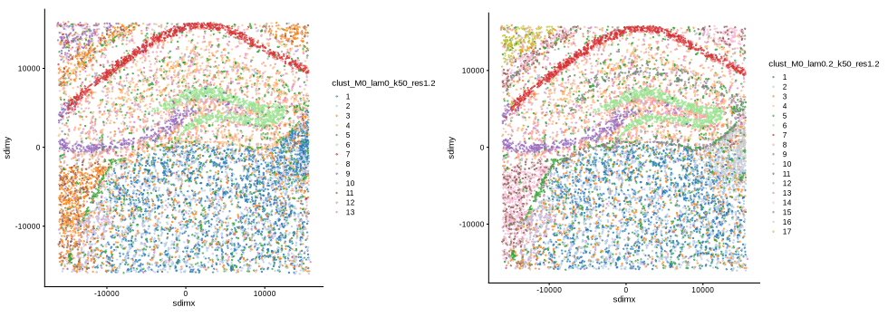
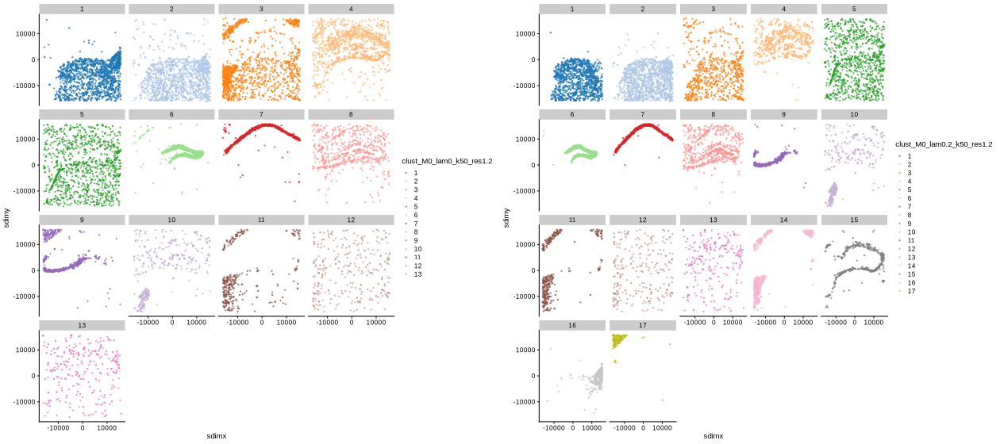
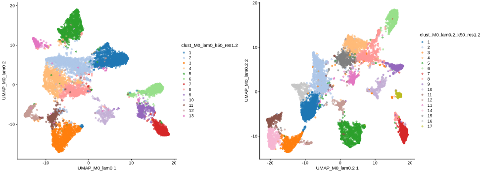

<!-- README.md is generated from README.Rmd. Please edit that file -->

## Overview

BANKSY is a method for clustering spatial omics data by augmenting the
features of each cell with both an average of the features of its
spatial neighbors along with neighborhood feature gradients. By
incorporating neighborhood information for clustering, BANKSY is able to

- improve cell-type assignment in noisy data
- distinguish subtly different cell-types stratified by microenvironment
- identify spatial domains sharing the same microenvironment

BANKSY is applicable to a wide array of spatial technologies (e.g. 10x
Visium, Slide-seq, MERFISH, CosMX, CODEX) and scales well to large
datasets. For more details, check out:

- the [paper](https://www.nature.com/articles/s41588-024-01664-3),
- the [peer review
  file](https://static-content.springer.com/esm/art%3A10.1038%2Fs41588-024-01664-3/MediaObjects/41588_2024_1664_MOESM3_ESM.pdf),
- a
  [tweetorial](https://x.com/shyam_lab/status/1762648072360792479?s=20)
  on BANKSY,
- a set of [vignettes](https://prabhakarlab.github.io/Banksy) showing
  basic usage,
- usage compatibility with Seurat
  ([here](https://github.com/satijalab/seurat-wrappers/blob/master/docs/banksy.md)
  and
  [here](https://satijalab.org/seurat/articles/visiumhd_analysis_vignette#identifying-spatially-defined-tissue-domains)),
- a [Python version](https://github.com/prabhakarlab/Banksy_py) of this
  package,
- a [Zenodo archive](https://zenodo.org/records/10258795) containing
  scripts to reproduce the analyses in the paper, and the corresponding
  [GitHub Pages](https://github.com/jleechung/banksy-zenodo) (and
  [here](https://github.com/prabhakarlab/Banksy_py/tree/Banksy_manuscript)
  for analyses done in Python).

**BANKSY now includes a lazy PCA mode (`lazy=TRUE` in `runBanksyPCA`)
that computes PCA directly via an implicit linear operator without
materializing the full BANKSY matrix. This is the default and
recommended mode. It has been benchmarked to 25 million cells at 5k
features, taking 12.5 min / 163 GB at 10 million cells and 34.6 min at
25 million with on-disk BPCells storage; see [NEWS](NEWS.md) for the
full table. For analysis on large datasets (\> 1 million samples), we
recommend using BANKSY via SeuratWrappers: see [this
vignette](https://github.com/satijalab/seurat-wrappers/blob/master/docs/banksy.md#scaling-to-large-datasets).**

## Installation

The *Banksy* package can be installed via Bioconductor. This currently
requires R `>= 4.4.0`.

``` r
BiocManager::install('Banksy')
```

To install directly from GitHub instead, use

``` r
remotes::install_github("prabhakarlab/Banksy")
```

To use the legacy version of *Banksy* utilising the `BanksyObject`
class, use

``` r
remotes::install_github("prabhakarlab/Banksy@legacy")
```

*Banksy* is also interoperable with
[*Seurat*](https://satijalab.org/seurat/) via
[*SeuratWrappers*](https://github.com/satijalab/seurat-wrappers).
Documentation on how to run BANKSY on Seurat objects can be found
[here](https://github.com/satijalab/seurat-wrappers/blob/master/docs/banksy.md).
For installation of *SeuratWrappers* with BANKSY version `>= 0.1.6`, run

``` r
remotes::install_github('satijalab/seurat-wrappers')
```

## Quick start

Load *BANKSY*. We’ll also load *SpatialExperiment* and
*SummarizedExperiment* for containing and manipulating the data,
*scuttle* for normalization and quality control, and *scater*, *ggplot2*
and *cowplot* for visualisation.

``` r
library(Banksy)

library(SummarizedExperiment)
library(SpatialExperiment)
library(scuttle)

library(scater)
library(cowplot)
library(ggplot2)
```

Here, we’ll run *BANKSY* on mouse hippocampus data.

``` r
data(hippocampus)
gcm <- hippocampus$expression
locs <- as.matrix(hippocampus$locations)
```

Initialize a SpatialExperiment object and perform basic quality control
and normalization.

``` r
se <- SpatialExperiment(assay = list(counts = gcm), spatialCoords = locs)

# QC based on total counts
qcstats <- perCellQCMetrics(se)
thres <- quantile(qcstats$total, c(0.05, 0.98))
keep <- (qcstats$total > thres[1]) & (qcstats$total < thres[2])
se <- se[, keep]

# Normalization to mean library size
se <- computeLibraryFactors(se)
aname <- "normcounts"
assay(se, aname) <- normalizeCounts(se, log = FALSE)
```

Run `runBanksyPCA` to compute BANKSY PCA embeddings. By default, this
uses a lazy linear operator that computes PCA without materializing the
full BANKSY matrix — computing the kNN graph and applying the BANKSY
transform on the fly during the iterative PCA solver. This is
memory-efficient and scales to millions of cells.

We run *BANKSY* at `lambda=0` corresponding to non-spatial clustering,
and `lambda=0.2` corresponding to *BANKSY* for cell-typing. The number
of spatial neighbors is set by `k_geom`.

> **An important note about choosing the `lambda` parameter for the
> older [Visium v1 / v2 55um
> datasets](https://doi.org/10.1038/s41593-020-00787-0) or the original
> [ST 100um technology](https://doi.org/10.1038/s41596-018-0045-2):**
>
> **Modern high resolution technologies** (Xenium, Visium HD, StereoSeq,
> MERFISH, STARmap PLUS, SeqFISH+, SlideSeq v2, and CosMx, and others):
> we recommend the usual defaults for `lambda`. For cell typing, use
> `lambda = 0.2` (as shown below, or in [this
> vignette](https://prabhakarlab.github.io/Banksy/articles/parameter-selection.html))
> and for [domain
> segmentation](https://prabhakarlab.github.io/Banksy/articles/domain-segment.html),
> use `lambda = 0.8`. These technologies are either imaging based,
> having true single-cell resolution (e.g., MERFISH), or are sequencing
> based, having barcoded spots on the scale of single-cells (e.g.,
> [Visium
> HD](https://www.10xgenomics.com/products/visium-hd-spatial-gene-expression)).
> We find that the usual defaults work well at this measurement
> resolution.
>
> **Older Visium v1/v2 or ST technologies** (with their much lower
> resolution spots, 55um and 100um diameter, respectively): we find that
> `lambda = 0.2` seems to work best for domain segmentation. This could
> be because each spot already measures the average transcriptome of
> several cells in a neighbourhood. It seems that `lambda = 0.2` shares
> enough information between these neighbourhoods to lead to good domain
> segmentation performance. For example, in the [human DLPFC
> vignette](https://prabhakarlab.github.io/Banksy/articles/multi-sample.html),
> we use `lambda = 0.2` on a Visium v1/v2 dataset. Also note that in
> these lower resolution technologies, each spot can have multiple cells
> of different types, and as such *cell-typing* is not defined for them.

``` r
lambda <- c(0, 0.2)

se <- Banksy::runBanksyPCA(se, assay_name = aname, lambda = lambda, k_geom = 15)
#> Computing neighbors...
#> Spatial mode is kNN_median
#> Parameters: k_geom=15
#> Done
#> --- lambda = 0 ---
#> Building sparse weight matrix
#> Computing scaling parameters for own expression
#> Computing clipping excess for own expression
#> Computing scaling params and clipping for H0
#> H0 genes requiring clipping: 0 / 120
#> Clipping corrections: own=0 H0=0 entries
#> Computing BANKSY PCA (20 PCs) via C++ irlba (work=27)
#>   iter=1  mprod=54  sv[20]=7.8915e+01  t=0s
#>   iter=2  mprod=68  sv[20]=9.4830e+01  t=0s
#>   iter=5  mprod=110  sv[20]=1.0418e+02  t=0s
#>   iter=10  mprod=180  sv[20]=1.0568e+02  t=0s
#>   iter=11  mprod=194  sv[20]=1.0568e+02  t=0s
#>   Converged: iter=11, mprod=194
#> --- lambda = 0.2 ---
#> Building sparse weight matrix
#> Computing scaling parameters for own expression
#> Computing clipping excess for own expression
#> Computing scaling params and clipping for H0
#> H0 genes requiring clipping: 0 / 120
#> Clipping corrections: own=0 H0=0 entries
#> Computing BANKSY PCA (20 PCs) via C++ irlba (work=27)
#>   iter=1  mprod=54  sv[20]=6.2809e+01  t=0s
#>   iter=2  mprod=68  sv[20]=8.2233e+01  t=0s
#>   iter=5  mprod=110  sv[20]=9.5297e+01  t=0s
#>   iter=9  mprod=166  sv[20]=9.6004e+01  t=0s
#>   Converged: iter=9, mprod=166
#> Done.
```

Next, compute UMAP and perform clustering:

``` r
set.seed(1000)
se <- Banksy::runBanksyUMAP(se, use_agf = FALSE, lambda = lambda)
se <- Banksy::clusterBanksy(se, use_agf = FALSE, lambda = lambda, resolution = 1.2)
```

Different clustering runs can be relabeled to minimise their differences
with `connectClusters`:

``` r
se <- Banksy::connectClusters(se)
#> clust_M0_lam0.2_k50_res1.2 --> clust_M0_lam0_k50_res1.2
```

Visualise the clustering output for non-spatial clustering (`lambda=0`)
and BANKSY clustering (`lambda=0.2`).

``` r
cnames <- colnames(colData(se))
cnames <- cnames[grep("^clust", cnames)]
colData(se) <- cbind(colData(se), spatialCoords(se))

plot_nsp <- plotColData(se,
    x = "sdimx", y = "sdimy",
    point_size = 0.6, colour_by = cnames[1]
)
plot_bank <- plotColData(se,
    x = "sdimx", y = "sdimy",
    point_size = 0.6, colour_by = cnames[2]
)


plot_grid(plot_nsp + coord_equal(), plot_bank + coord_equal(), ncol = 2)
```



For clarity, we can visualise each of the clusters separately:

``` r
plot_grid(
    plot_nsp + facet_wrap(~colour_by),
    plot_bank + facet_wrap(~colour_by),
    ncol = 2
)
```



Visualize UMAPs of the non-spatial and BANKSY embedding:

``` r
rdnames <- reducedDimNames(se)

umap_nsp <- plotReducedDim(se,
    dimred = grep("UMAP.*lam0$", rdnames, value = TRUE),
    colour_by = cnames[1]
)
umap_bank <- plotReducedDim(se,
    dimred = grep("UMAP.*lam0.2$", rdnames, value = TRUE),
    colour_by = cnames[2]
)
plot_grid(
    umap_nsp,
    umap_bank,
    ncol = 2
)
```



<details>

<summary>

Runtime for analysis
</summary>

    #> Time difference of 46.63217 secs

</details>

<details>

<summary>

Session information
</summary>

``` r
options(width = 120)
sessioninfo::session_info()
#> ─ Session info ───────────────────────────────────────────────────────────────────────────────────────────────────────
#>  setting  value
#>  version  R version 4.5.1 (2025-06-13)
#>  os       Rocky Linux 9.8 (Blue Onyx)
#>  system   x86_64, linux-gnu
#>  ui       X11
#>  language (EN)
#>  collate  C.UTF-8
#>  ctype    C.UTF-8
#>  tz       America/Los_Angeles
#>  date     2026-09-29
#>  pandoc   3.11 @ /gpfs/scrubbed/jxlee/conda/envs/banksy-bench-2/bin/ (via rmarkdown)
#>  quarto   NA
#> 
#> ─ Packages ───────────────────────────────────────────────────────────────────────────────────────────────────────────
#>  package              * version  date (UTC) lib source
#>  abind                  1.4-8    2024-09-12 [1] CRAN (R 4.5.1)
#>  aricode                1.1.0    2026-05-13 [1] CRAN (R 4.5.3)
#>  Banksy               * 1.9.4    2026-09-29 [1] local (/gpfs/projects/h2lab/jxlee/genome-institute/Banksy)
#>  beachmat               2.26.0   2025-10-29 [1] Bioconductor 3.22 (R 4.5.2)
#>  beeswarm               0.4.0    2021-06-01 [1] CRAN (R 4.5.1)
#>  Biobase              * 2.70.0   2025-10-29 [1] Bioconductor 3.22 (R 4.5.2)
#>  BiocGenerics         * 0.56.0   2025-10-29 [1] Bioconductor 3.22 (R 4.5.2)
#>  BiocNeighbors          2.4.0    2025-10-29 [1] Bioconductor 3.22 (R 4.5.2)
#>  BiocParallel           1.44.0   2025-10-29 [1] Bioconductor 3.22 (R 4.5.2)
#>  BiocSingular           1.26.1   2025-11-17 [1] Bioconductor 3.22 (R 4.5.2)
#>  cli                    3.6.6    2026-04-09 [1] CRAN (R 4.5.3)
#>  codetools              0.2-20   2024-03-31 [1] CRAN (R 4.5.1)
#>  cowplot              * 1.2.0    2025-07-07 [1] CRAN (R 4.5.1)
#>  data.table             1.18.6.1 2026-08-24 [1] CRAN (R 4.5.3)
#>  dbscan                 1.2.6    2026-08-25 [1] CRAN (R 4.5.3)
#>  DelayedArray           0.36.1   2026-03-31 [1] Bioconductor 3.22 (R 4.5.3)
#>  dichromat              2.0-1    2026-07-22 [1] CRAN (R 4.5.3)
#>  digest                 0.6.39   2025-11-19 [1] CRAN (R 4.5.2)
#>  dplyr                  1.2.1    2026-04-03 [1] CRAN (R 4.5.3)
#>  evaluate               1.0.5    2025-08-27 [1] CRAN (R 4.5.1)
#>  farver                 2.1.2    2024-05-13 [1] CRAN (R 4.5.1)
#>  fastmap                1.2.0    2024-05-15 [1] CRAN (R 4.5.1)
#>  generics             * 0.1.4    2025-05-09 [1] CRAN (R 4.5.1)
#>  GenomicRanges        * 1.62.1   2025-12-08 [1] Bioconductor 3.22 (R 4.5.2)
#>  ggbeeswarm             0.7.3    2025-11-29 [1] CRAN (R 4.5.2)
#>  ggplot2              * 4.0.3    2026-04-22 [1] CRAN (R 4.5.3)
#>  ggrepel                0.9.8    2026-03-17 [1] CRAN (R 4.5.3)
#>  glue                   1.8.1    2026-04-17 [1] CRAN (R 4.5.3)
#>  gridExtra              2.3.1    2026-06-25 [1] CRAN (R 4.5.3)
#>  gtable                 0.3.6    2024-10-25 [1] CRAN (R 4.5.1)
#>  htmltools              0.5.9    2025-12-04 [1] CRAN (R 4.5.2)
#>  igraph                 2.3.3    2026-06-26 [1] CRAN (R 4.5.3)
#>  IRanges              * 2.44.0   2025-10-29 [1] Bioconductor 3.22 (R 4.5.2)
#>  irlba                  2.3.7    2026-01-30 [1] CRAN (R 4.5.2)
#>  knitr                  1.52     2026-09-06 [1] CRAN (R 4.5.3)
#>  labeling               0.4.3    2023-08-29 [1] CRAN (R 4.5.1)
#>  lattice                0.23-1   2026-08-12 [1] CRAN (R 4.5.3)
#>  leidenAlg              1.1.8    2026-05-31 [1] CRAN (R 4.5.3)
#>  lifecycle              1.0.5    2026-01-08 [1] CRAN (R 4.5.2)
#>  magick                 2.9.1    2026-02-28 [1] CRAN (R 4.5.2)
#>  magrittr               2.0.5    2026-04-04 [1] CRAN (R 4.5.3)
#>  Matrix                 1.7-6    2026-07-25 [1] CRAN (R 4.5.3)
#>  MatrixGenerics       * 1.22.0   2025-10-29 [1] Bioconductor 3.22 (R 4.5.2)
#>  matrixStats          * 1.5.0    2025-01-07 [1] CRAN (R 4.5.1)
#>  mclust                 6.1.3    2026-07-05 [1] CRAN (R 4.5.3)
#>  otel                   0.2.0    2025-08-29 [1] CRAN (R 4.5.1)
#>  pillar                 1.11.1   2025-09-17 [1] CRAN (R 4.5.1)
#>  pkgconfig              2.0.3    2019-09-22 [1] CRAN (R 4.5.1)
#>  R6                     2.6.1    2025-02-15 [1] CRAN (R 4.5.1)
#>  RColorBrewer           1.1-3    2022-04-03 [1] CRAN (R 4.5.1)
#>  Rcpp                   1.1.2    2026-07-05 [1] CRAN (R 4.5.3)
#>  RcppAnnoy              0.0.23   2026-01-12 [1] CRAN (R 4.5.2)
#>  RcppHungarian          0.3      2023-09-05 [1] CRAN (R 4.5.3)
#>  rjson                  0.2.23   2024-09-16 [1] CRAN (R 4.5.1)
#>  rlang                  1.3.0    2026-07-05 [1] CRAN (R 4.5.3)
#>  rmarkdown              2.32     2026-09-01 [1] CRAN (R 4.5.3)
#>  RSpectra               0.16-2   2024-07-18 [1] CRAN (R 4.5.1)
#>  rsvd                   1.0.5    2021-04-16 [1] CRAN (R 4.5.1)
#>  S4Arrays               1.10.1   2025-12-01 [1] Bioconductor 3.22 (R 4.5.2)
#>  S4Vectors            * 0.48.1   2026-04-05 [1] Bioconductor 3.22 (R 4.5.3)
#>  S7                     0.2.2    2026-04-22 [1] CRAN (R 4.5.3)
#>  ScaledMatrix           1.18.0   2025-10-29 [1] Bioconductor 3.22 (R 4.5.2)
#>  scales                 1.4.0    2025-04-24 [1] CRAN (R 4.5.1)
#>  scater               * 1.38.1   2026-03-20 [1] Bioconductor 3.22 (R 4.5.3)
#>  sccore                 1.0.7    2026-04-06 [1] CRAN (R 4.5.3)
#>  scuttle              * 1.20.0   2025-10-30 [1] Bioconductor 3.22 (R 4.5.2)
#>  Seqinfo              * 1.0.0    2025-10-29 [1] Bioconductor 3.22 (R 4.5.2)
#>  sessioninfo            1.2.4    2026-06-04 [1] CRAN (R 4.5.3)
#>  SingleCellExperiment * 1.32.0   2025-10-29 [1] Bioconductor 3.22 (R 4.5.2)
#>  SparseArray            1.10.10  2026-03-30 [1] Bioconductor 3.22 (R 4.5.3)
#>  SpatialExperiment    * 1.20.0   2025-10-29 [1] Bioconductor 3.22 (R 4.5.2)
#>  SummarizedExperiment * 1.40.0   2025-10-29 [1] Bioconductor 3.22 (R 4.5.2)
#>  tibble                 3.3.1    2026-01-11 [1] CRAN (R 4.5.2)
#>  tidyselect             1.2.1    2024-03-11 [1] CRAN (R 4.5.1)
#>  uwot                   0.2.5    2026-08-29 [1] CRAN (R 4.5.3)
#>  vctrs                  0.7.3    2026-04-11 [1] CRAN (R 4.5.3)
#>  vipor                  0.4.7    2023-12-18 [1] CRAN (R 4.5.1)
#>  viridis                0.6.5    2024-01-29 [1] CRAN (R 4.5.1)
#>  viridisLite            0.4.3    2026-02-04 [1] CRAN (R 4.5.2)
#>  withr                  3.0.3    2026-06-19 [1] CRAN (R 4.5.3)
#>  xfun                   0.60     2026-07-09 [1] CRAN (R 4.5.3)
#>  XVector                0.50.0   2025-10-29 [1] Bioconductor 3.22 (R 4.5.2)
#>  yaml                   2.3.12   2025-12-10 [1] CRAN (R 4.5.2)
#> 
#>  [1] /gpfs/scrubbed/jxlee/conda/envs/banksy-bench-2/lib/R/library
#>  * ── Packages attached to the search path.
#> 
#> ──────────────────────────────────────────────────────────────────────────────────────────────────────────────────────
```

</details>
