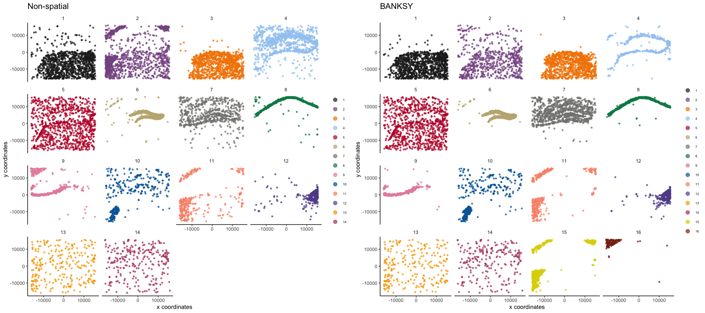

<!-- README.md is generated from README.Rmd. Please edit that file -->
<!-- badges: start -->

[](https://github.com/jleechung/Banksy/actions/workflows/check-standard.yml)
[](https://codecov.io/gh/jleechung/Banksy)
[](https://github.com/jleechung/Banksy/graphs/commit-activity)
<!-- badges: end -->

## Overview

BANKSY is a method for clustering spatial transcriptomic data by
augmenting the transcriptomic profile of each cell with an average of
the transcriptomes of its spatial neighbors. By incorporating
neighborhood information for clustering, BANKSY is able to

- improve cell-type assignment in noisy data
- distinguish subtly different cell-types stratified by microenvironment
- identify spatial zones sharing the same microenvironment

BANKSY is applicable to a wide array of spatial technologies (e.g. 10x
Visium, Slide-seq, MERFISH) and scales well to large datasets. For more
details, check out:

- the
  [preprint](https://www.biorxiv.org/content/10.1101/2022.04.14.488259v1),
- a
  [tweetorial](https://twitter.com/vipul1891/status/1515323372535644166?s=20&t=Bc6rz8VeWWptF67FejGYfQ)
  on BANKSY,
- and a [Python version](https://github.com/prabhakarlab/Banksy_py) of
  this package.

## Installation

The *Banksy* package can be installed via `remotes`:

``` r
remotes::install_github("prabhakarlab/Banksy", dependencies = TRUE)
```

Installation should take less than three minutes.

**Known installation issues**

1.  Installation of `leidenAlg` has non-zero exit status

- Refer to the [`leidenAlg` package
  website](https://github.com/kharchenkolab/leidenAlg#installation) for
  installation details.

## Documentation

Detailed description of *Banksy* functionality and example analyses are
available at the [package
webpage](https://prabhakarlab.github.io/Banksy/).

*Banksy* comes installed with
[documentation](https://prabhakarlab.github.io/Banksy/reference/index.html)
of main functions and their usage, along with several vignettes which
detail different use cases:

- [Working with Banksy
  objects](https://prabhakarlab.github.io/Banksy/articles/banksy-object.html):
  Introduction to the *BanksyObject* class which serves as a container
  for *Banksy*.

- [Mouse hippocampus VeraFISH
  dataset](https://prabhakarlab.github.io/Banksy/articles/hippocampus-analysis.html):
  Illustrates a grid search of parameters which best cluster cells.

- [Human dorsolateral prefrontal cortex 10x Visium
  dataset](https://prabhakarlab.github.io/Banksy/articles/dlpfc-analysis.html):
  Illustrates analysis of multiple spatial transcriptomic datasets.

- [Mouse hypothalamus MERFISH
  dataset](https://prabhakarlab.github.io/Banksy/articles/hypothalamus-analysis.html):
  Illustrates visualization functionality with a dataset with 3 spatial
  dimensions.

- [Interoperability with
  SingleCellExperiment](https://prabhakarlab.github.io/Banksy/articles/single-cell-exp.html):
  Illustrates BANKSY interoperability with Bioconductor
  [SingleCellExperiment](https://bioconductor.org/packages/release/bioc/html/SingleCellExperiment.html)
  framework for interfacing with packages like
  [scran](https://bioconductor.org/packages/release/bioc/html/scran.html)
  or
  [scater](https://bioconductor.org/packages/release/bioc/html/scater.html).

*Banksy* is also interoperable with
[Seurat](https://satijalab.org/seurat/) via *SeuratWrappers*.
Documentation on how to run BANKSY on Seurat objects can be found
[here](https://github.com/jleechung/seurat-wrappers/blob/feat-aft/docs/banksy.md).
For installation of *SeuratWrappers* with BANKSY version `>= 0.1.4`, run

``` r
remotes::install_github('jleechung/seurat-wrappers@feat-aft')
```

## Quick start

*Banksy* takes as input an expression matrix and cell centroids. Example
datasets are provided with the package:

``` r
library(Banksy)

data(hippocampus)
expr <- hippocampus$expression
locs <- hippocampus$locations
```

The gene expression matrix for cells should be a `matrix`:

``` r
class(expr)
#> [1] "matrix" "array"
head(expr[,1:5])
#>         cell_1276 cell_8890 cell_691 cell_396 cell_9818
#> Sparcl1        45         0       11       22         0
#> Slc1a2         17         0        6        5         0
#> Map            10         0       12       16         0
#> Sqstm1         26         0        0        2         0
#> Atp1a2          0         0        4        3         0
#> Tnc             0         0        0        0         0
```

while cell locations should be supplied as a `data.frame`:

``` r
class(locs)
#> [1] "data.frame"
head(locs)
#>                 sdimx    sdimy
#> cell_1276  -13372.899 15776.37
#> cell_8890    8941.101 15866.37
#> cell_691   -14882.899 15896.37
#> cell_396   -15492.899 15835.37
#> cell_9818   11308.101 15846.37
#> cell_11310  14894.101 15810.37
```

Next, create a *BanksyObject* with the expression matrix and cell
locations.

``` r
bank <- BanksyObject(own.expr = expr,
                     cell.locs = locs)

head(bank)
#> own expression:
#>         cell_1276 cell_8890 cell_691 cell_396 cell_9818
#> Sparcl1        45         0       11       22         0
#> Slc1a2         17         0        6        5         0
#> Map            10         0       12       16         0
#> Sqstm1         26         0        0        2         0
#> Atp1a2          0         0        4        3         0
#> 
#> neighbour expression:
#> NULL
#> 
#> cell locations:
#>                sdimx    sdimy
#> cell_1276 -13372.899 15776.37
#> cell_8890   8941.101 15866.37
#> cell_691  -14882.899 15896.37
#> cell_396  -15492.899 15835.37
#> cell_9818  11308.101 15846.37
#> 
#> metadata:
#>             cell_ID nCount NODG
#> cell_1276 cell_1276    266   51
#> cell_8890 cell_8890     13    3
#> cell_691   cell_691    132   36
#> cell_396   cell_396     95   27
#> cell_9818 cell_9818     10    5
```

Apply basic QC by keeping only cells with total counts within the 5th
and 98th percentile:

``` r
bank <- SubsetBanksy(bank, metadata = nCount > quantile(nCount, 0.05) &
                                      nCount < quantile(nCount, 0.98))
```

We first normalize the expression matrix, compute the neighbor matrix,
and scale the resulting matrices.

``` r
bank <- NormalizeBanksy(bank)
bank <- ComputeBanksy(bank, k_geom = 15)
#> Computing neighbors...
#> Spatial mode is kNN median
#> Parameters: k_geom = 15
#> Done
#> Computing harmonic m = 0
#> Using 15 neighbors
#> Done
bank <- ScaleBanksy(bank)
```

Run PCA on the BANKSY matrix for `lambda=0` (no spatial information) and
`lambda=0.2`.

``` r
bank <- RunBanksyPCA(bank, lambda = c(0, 0.2))
#> Running PCA for M=0 lambda=0
#> BANKSY matrix with own.expr, F0
#> Squared lambdas: 1, 0
#> Running PCA for M=0 lambda=0.2
#> BANKSY matrix with own.expr, F0
#> Squared lambdas: 0.8, 0.2
```

Next, we obtain cluster assignments using graph-based clustering with
the Leiden algorithm on the first 20 PCs.

``` r
set.seed(42)
bank <- ClusterBanksy(bank, lambda = c(0, 0.2), pca = TRUE, npcs = 20,
                      method = 'leiden', resolution = 1.2)
```

Different clustering runs can be harmonised with `ConnectClusters`:

``` r
bank <- ConnectClusters(bank, map.to = clust.names(bank)[1])
```

Visualise the clustering output for non-spatial clustering (`lambda=0`)
and BANKSY clustering (`lambda=0.2`).

``` r
features <- clust.names(bank)
feature.types <- rep('discrete', 2)
main <- c('Non-spatial', 'BANKSY')
plotSpatialFeatures(bank, by = features, type = feature.types, main = main, 
                    pt.size = 1.5, main.size = 15, nrow = 1, ncol = 2)
```


For clarity, we can visualise each of the clusters separately with
`wrap = TRUE`:

``` r
plotSpatialFeatures(bank, by = features, type = feature.types, main = main, 
                    pt.size = 1, main.size = 15, nrow = 1, ncol = 2, 
                    wrap = TRUE)
```



<details>
<summary>
Runtime for analysis
</summary>

    #> Time difference of 46.16683 secs

</details>
<details>
<summary>
Session information
</summary>

``` r
sessionInfo()
#> R version 4.3.2 (2023-10-31)
#> Platform: aarch64-apple-darwin20 (64-bit)
#> Running under: macOS Sonoma 14.2.1
#> 
#> Matrix products: default
#> BLAS:   /Library/Frameworks/R.framework/Versions/4.3-arm64/Resources/lib/libRblas.0.dylib 
#> LAPACK: /Library/Frameworks/R.framework/Versions/4.3-arm64/Resources/lib/libRlapack.dylib;  LAPACK version 3.11.0
#> 
#> locale:
#> [1] en_US.UTF-8/en_US.UTF-8/en_US.UTF-8/C/en_US.UTF-8/en_US.UTF-8
#> 
#> time zone: Europe/London
#> tzcode source: internal
#> 
#> attached base packages:
#> [1] stats     graphics  grDevices utils     datasets  methods   base     
#> 
#> other attached packages:
#> [1] Banksy_0.1.5
#> 
#> loaded via a namespace (and not attached):
#>  [1] tidyselect_1.2.0            farver_2.1.1               
#>  [3] dplyr_1.1.4                 bitops_1.0-7               
#>  [5] fastmap_1.1.1               RCurl_1.98-1.14            
#>  [7] digest_0.6.34               lifecycle_1.0.4            
#>  [9] cluster_2.1.6               ggalluvial_0.12.5          
#> [11] magrittr_2.0.3              dbscan_1.1-12              
#> [13] compiler_4.3.2              progress_1.2.3             
#> [15] rlang_1.1.3                 tools_4.3.2                
#> [17] igraph_2.0.1.1              utf8_1.2.4                 
#> [19] yaml_2.3.8                  data.table_1.15.0          
#> [21] knitr_1.45                  labeling_0.4.3             
#> [23] prettyunits_1.2.0           S4Arrays_1.2.0             
#> [25] mclust_6.0.1                DelayedArray_0.28.0        
#> [27] plyr_1.8.9                  mapproj_1.2.11             
#> [29] RColorBrewer_1.1-3          abind_1.4-5                
#> [31] withr_3.0.0                 BiocGenerics_0.48.1        
#> [33] grid_4.3.2                  stats4_4.3.2               
#> [35] fansi_1.0.6                 colorspace_2.1-0           
#> [37] ggplot2_3.4.4               scales_1.3.0               
#> [39] iterators_1.0.14            pals_1.8                   
#> [41] dichromat_2.0-0.1           SummarizedExperiment_1.32.0
#> [43] cli_3.6.2                   rmarkdown_2.25             
#> [45] crayon_1.5.2                leidenAlg_1.1.2            
#> [47] generics_0.1.3              rstudioapi_0.15.0          
#> [49] rjson_0.2.21                RcppHungarian_0.3          
#> [51] zlibbioc_1.48.0             maps_3.4.2                 
#> [53] parallel_4.3.2              XVector_0.42.0             
#> [55] matrixStats_1.2.0           vctrs_0.6.5                
#> [57] Matrix_1.6-5                hms_1.1.3                  
#> [59] IRanges_2.36.0              GetoptLong_1.0.5           
#> [61] S4Vectors_0.40.2            irlba_2.3.5.1              
#> [63] clue_0.3-65                 foreach_1.5.2              
#> [65] glue_1.7.0                  codetools_0.2-19           
#> [67] uwot_0.1.16                 shape_1.4.6                
#> [69] gtable_0.3.4                GenomeInfoDb_1.38.6        
#> [71] GenomicRanges_1.54.1        ComplexHeatmap_2.18.0      
#> [73] munsell_0.5.0               tibble_3.2.1               
#> [75] pillar_1.9.0                htmltools_0.5.7            
#> [77] GenomeInfoDbData_1.2.11     circlize_0.4.15            
#> [79] R6_2.5.1                    doParallel_1.0.17          
#> [81] evaluate_0.23               sccore_1.0.4               
#> [83] lattice_0.22-5              Biobase_2.62.0             
#> [85] highr_0.10                  png_0.1-8                  
#> [87] Rcpp_1.0.12                 gridExtra_2.3              
#> [89] SparseArray_1.2.4           xfun_0.42                  
#> [91] MatrixGenerics_1.14.0       pkgconfig_2.0.3            
#> [93] GlobalOptions_0.1.2
```

</details>

## Contributing

Bug reports, questions, request for enhancements or other contributions
can be raised at the [issue
page](https://github.com/prabhakarlab/Banksy/issues).
