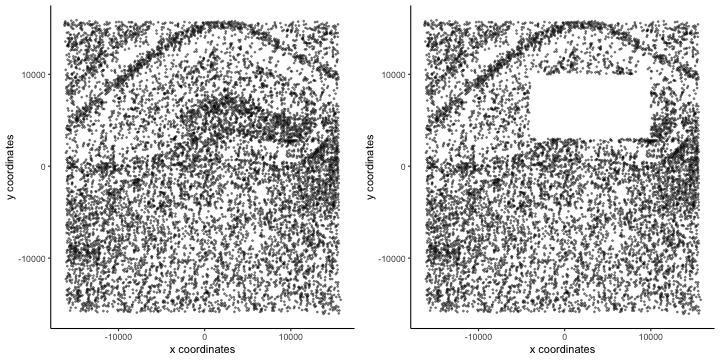
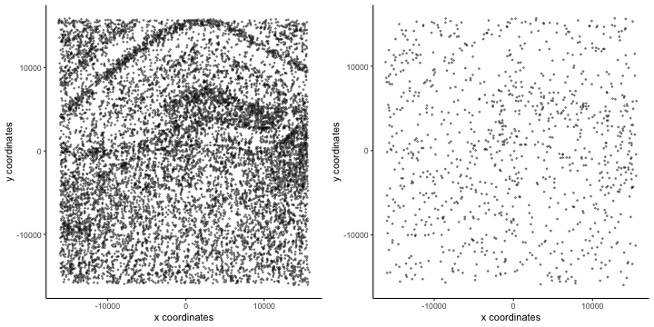
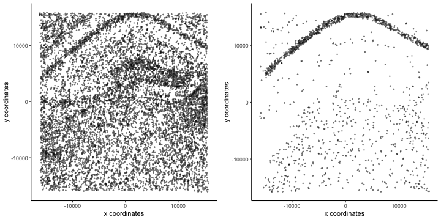

This article describes the *BanksyObject* class in detail and how to interact 
with it. 

## Class structure

We use data attached with the package:


```r
library(Banksy)

data(hippocampus)
expr <- hippocampus$expression
locs <- hippocampus$locations
```

We store the total counts and the number of expressed genes for each cell:


```r
total_count <- colSums(expr)
num_genes <- colSums(expr > 0)
meta <- data.frame(total_count = total_count, num_genes = num_genes)
```

The *BanksyObject* can be constructed by supplying the gene-cell expression 
matrix and cell locations. Optionally, metadata can be provided. Calling 
*BanksyObject* populates metadata and performs gene filtering in the case of 
multiple datasets. This should be the default method of construction - avoid 
setter methods for construction. 


```r
bank <- BanksyObject(own.expr = expr, cell.locs = locs, meta.data = meta)
# Filter cells based on total count 
bank <- SubsetBanksy(bank, metadata = total_count > quantile(total_count, 0.05) &
                                      total_count < quantile(total_count, 0.98))

bank
#> Object of class BanksyObject 
#> Assay with 10205 cells 120 features
#> Spatial dimensions: sdimx sdimy 
#> Metadata names: cell_ID nCount NODG 
#> Dimension reductions:
```

The filtered dataset consists of 10,205 cells and 129 genes in 2 spatial 
dimensions.

*BanksyObject* has the following slots:


```r
slotNames(bank)
#> [1] "own.expr"    "nbr.expr"    "harmonics"   "custom.expr" "cell.locs"   "meta.data"   "reduction"
```

* `own.expr` stores the gene by cell expression matrix  
* `nbr.expr` stores the averaged neighborhood expression matrix
* `harmonics` stores higher neighborhood harmonics matrices
* `custom.expr` is an auxillary slot for storing a custom expression matrix
* `cell.locs` stores the cell locations   
* `meta.data` stores cell metadata, such as cluster labels or colours for 
   visualisation  
*  `reduction` stores dimension reductions 

Getter and setter methods are defined for each of these slots.

Calling *ComputeBanksy* computes the neighbour feature-cell expression matrix,
populating the `nbr.expr` slot: 


```r
bank <- NormalizeBanksy(bank)
bank <- ComputeBanksy(bank, verbose=FALSE)
bank <- ScaleBanksy(bank)
```

Dimensionality reduction with *RunBanksyPCA* or *RunBanksyUMAP* populates the `reduction`
slot:


```r
bank <- RunBanksyPCA(bank, lambda = 0.2)

names(reduction(bank))
#> [1] "pca_M0_lam0.2"
```

Perform clustering with *ClusterBanksy*. This populates the `meta.data` slot
with cluster labels.


```r
set.seed(42)
bank <- ClusterBanksy(bank, lambda = 0.2, pca = TRUE, npcs = 20,
                      method = 'leiden', resolution = 1.2, k.neighbors = 50)

head(meta.data(bank))
#>             cell_ID nCount NODG clust_M0_lam0.2_k50_res1.2
#> cell_1276 cell_1276    266   51                         17
#> cell_691   cell_691    132   36                          7
#> cell_396   cell_396     95   27                         17
#> cell_68     cell_68    579   72                         17
#> cell_6954 cell_6954    116   29                          6
#> cell_7074 cell_7074     28   17                          6
```

## Subsetting

*SubsetBanksy* allows users to subset a *BanksyObject* by dimension, genes, 
cells, and metadata columns. The *BanksyObject* can be subset by dimensions with
logical unquoted conditions. The variables here (e.g. `sdimx`) must correspond
to the columns names of the `cell.locs(bank)`. 


```r
bankDim <- SubsetBanksy(bank, dims = (sdimx < -4000 | sdimx > 10000) | 
                                     (sdimy < 3000 | sdimy > 10000))

gridExtra::grid.arrange(
  plotSpatial(bank, pt.alpha = 0.4),
  plotSpatial(bankDim, pt.alpha = 0.4),
  ncol = 2
)
```

<div class="figure" style="text-align: center">

<p class="caption">plot of chunk subset1</p>
</div>

The object can also be subset by cells:


```r
sample_cells <- sample(meta.data(bank)$cell_ID, 1000)
bankCells <- SubsetBanksy(bank, cells = sample_cells)

gridExtra::grid.arrange(
  plotSpatial(bank, pt.alpha = 0.4),
  plotSpatial(bankCells, pt.alpha = 0.4),
  ncol = 2
)
```

<div class="figure" style="text-align: center">

<p class="caption">plot of chunk subset2</p>
</div>

Similarly, the object can also be subset by any metadata column with logical 
unquoted conditions. Here, we select cells in in certain clusters based on the 
clustering with `lam=0.3`, `k=50`, `res=1.2`. 


```r
select_clusters <- c(6,7)
bankMeta <- SubsetBanksy(bank, metadata = clust_M0_lam0.2_k50_res1.2 %in% select_clusters)

gridExtra::grid.arrange(
  plotSpatial(bank, pt.alpha = 0.4),
  plotSpatial(bankMeta, pt.alpha = 0.4),
  ncol = 2
)
```

<div class="figure" style="text-align: center">

<p class="caption">plot of chunk subset3</p>
</div>

Subsetting by genes can be achieved by supplying a character vector of genes
to the `features` argument:


```r
genes <- sample(rownames(own.expr(bank)), 10)
bankFeatures <- SubsetBanksy(bank, features = genes)
```

If multiple subsetting features are supplied, the intersection of all conditions
will be returned.

## Session information

<details>


```r
sessionInfo()
#> R version 4.3.2 (2023-10-31)
#> Platform: aarch64-apple-darwin20 (64-bit)
#> Running under: macOS Sonoma 14.2.1
#> 
#> Matrix products: default
#> BLAS:   /System/Library/Frameworks/Accelerate.framework/Versions/A/Frameworks/vecLib.framework/Versions/A/libBLAS.dylib 
#> LAPACK: /Library/Frameworks/R.framework/Versions/4.3-arm64/Resources/lib/libRlapack.dylib;  LAPACK version 3.11.0
#> 
#> locale:
#> [1] en_US.UTF-8/en_US.UTF-8/en_US.UTF-8/C/en_US.UTF-8/en_US.UTF-8
#> 
#> time zone: Europe/London
#> tzcode source: internal
#> 
#> attached base packages:
#> [1] stats     graphics  grDevices utils     datasets  methods   base     
#> 
#> other attached packages:
#> [1] Banksy_0.1.6
#> 
#> loaded via a namespace (and not attached):
#>   [1] RColorBrewer_1.1-3          rstudioapi_0.15.0           shape_1.4.6                 magrittr_2.0.3             
#>   [5] ggbeeswarm_0.7.2            magick_2.8.2                farver_2.1.1                rmarkdown_2.25             
#>   [9] GlobalOptions_0.1.2         fs_1.6.3                    zlibbioc_1.48.0             vctrs_0.6.5                
#>  [13] memoise_2.0.1               DelayedMatrixStats_1.24.0   RCurl_1.98-1.14             progress_1.2.3             
#>  [17] htmltools_0.5.7             S4Arrays_1.2.0              usethis_2.2.2               BiocNeighbors_1.20.2       
#>  [21] SparseArray_1.2.4           htmlwidgets_1.6.4           desc_1.4.3                  plyr_1.8.9                 
#>  [25] cachem_1.0.8                igraph_2.0.1.1              mime_0.12                   lifecycle_1.0.4            
#>  [29] iterators_1.0.14            pkgconfig_2.0.3             rsvd_1.0.5                  Matrix_1.6-5               
#>  [33] R6_2.5.1                    fastmap_1.1.1               GenomeInfoDbData_1.2.11     MatrixGenerics_1.14.0      
#>  [37] shiny_1.8.0                 aricode_1.0.3               clue_0.3-65                 digest_0.6.34              
#>  [41] colorspace_2.1-0            S4Vectors_0.40.2            ps_1.7.6                    scater_1.30.1              
#>  [45] irlba_2.3.5.1               pkgload_1.3.4               GenomicRanges_1.54.1        beachmat_2.18.0            
#>  [49] labeling_0.4.3              sccore_1.0.4                fansi_1.0.6                 abind_1.4-5                
#>  [53] compiler_4.3.2              remotes_2.4.2.1             withr_3.0.0                 doParallel_1.0.17          
#>  [57] BiocParallel_1.36.0         viridis_0.6.5               highr_0.10                  pkgbuild_1.4.3             
#>  [61] maps_3.4.2                  DelayedArray_0.28.0         sessioninfo_1.2.2           rjson_0.2.21               
#>  [65] tools_4.3.2                 vipor_0.4.7                 beeswarm_0.4.0              httpuv_1.6.14              
#>  [69] glue_1.7.0                  dbscan_1.1-12               callr_3.7.3                 promises_1.2.1             
#>  [73] grid_4.3.2                  cluster_2.1.6               generics_0.1.3              gtable_0.3.4               
#>  [77] hms_1.1.3                   data.table_1.15.0           BiocSingular_1.18.0         ScaledMatrix_1.10.0        
#>  [81] utf8_1.2.4                  XVector_0.42.0              BiocGenerics_0.48.1         ggrepel_0.9.5              
#>  [85] foreach_1.5.2               pillar_1.9.0                stringr_1.5.1               pals_1.8                   
#>  [89] RcppHungarian_0.3           later_1.3.2                 circlize_0.4.15             dplyr_1.1.4                
#>  [93] lattice_0.22-5              tidyselect_1.2.0            ComplexHeatmap_2.18.0       SingleCellExperiment_1.24.0
#>  [97] miniUI_0.1.1.1              scuttle_1.12.0              knitr_1.45                  gridExtra_2.3              
#> [101] IRanges_2.36.0              SummarizedExperiment_1.32.0 stats4_4.3.2                xfun_0.42                  
#> [105] Biobase_2.62.0              devtools_2.4.5              matrixStats_1.2.0           stringi_1.8.3              
#> [109] yaml_2.3.8                  evaluate_0.23               codetools_0.2-19            tibble_3.2.1               
#> [113] cli_3.6.2                   uwot_0.1.16                 xtable_1.8-4                leidenAlg_1.1.2            
#> [117] munsell_0.5.0               processx_3.8.3              dichromat_2.0-0.1           Rcpp_1.0.12                
#> [121] GenomeInfoDb_1.38.6         mapproj_1.2.11              png_0.1-8                   parallel_4.3.2             
#> [125] ellipsis_0.3.2              ggplot2_3.4.4               prettyunits_1.2.0           ggalluvial_0.12.5          
#> [129] mclust_6.0.1                profvis_0.3.8               urlchecker_1.0.1            sparseMatrixStats_1.14.0   
#> [133] bitops_1.0-7                SpatialExperiment_1.12.0    viridisLite_0.4.2           scales_1.3.0               
#> [137] purrr_1.0.2                 crayon_1.5.2                GetoptLong_1.0.5            rlang_1.1.3
```

</details>

