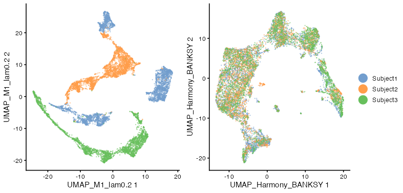
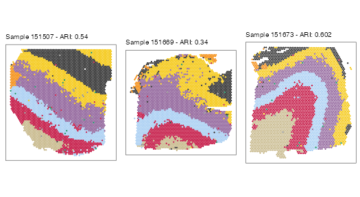

```{r, include = FALSE}
knitr::opts_chunk$set(
    collapse = TRUE,
    comment = "#>",
    fig.path = "figures/"
)
```

Here, we demonstrate how BANKSY can be used with Harmony for integrating 
multiple spatial omics datasets in the presence of strong batch effects. We use 
10x Visium data of the human dorsolateral prefrontal cortex from Maynard et al 
(2018). The data comprise 12 samples obtained from 3 subjects, with manual 
annotation of the layers in each sample. 

```{r, eval=FALSE, message=FALSE, warning=FALSE}
library(Banksy)
library(SummarizedExperiment)
library(SpatialExperiment)
library(singleCellTK)
library(scran)
library(data.table)
library(harmony)

library(scater)
library(cowplot)
library(ggplot2)
library(ggspavis)

SEED <- 1000
```

## Loading the data

We fetch the data for all 12 DLPFC samples with the 
[*spatialLIBD*](https://bioconductor.org/packages/release/data/experiment/html/spatialLIBD.html) 
package. This might take awhile.

```{r, eval=FALSE}
library(spatialLIBD)
library(ExperimentHub)

ehub <- ExperimentHub::ExperimentHub()
spe <- spatialLIBD::fetch_data(type = "spe", eh = ehub)
sample_names <- unique(spe$sample_id)
```

After the download is completed, we trim the *SpatialExperiment* object, 
retaining only the counts and some metadata such as the sample identifier and 
pathology annotations. This saves some memory.

```{r, eval=FALSE}
#' Remove NA spots
na_id <- which(is.na(spe$layer_guess_reordered_short))
spe <- spe[, -na_id]

#' Trim
imgData(spe) <- NULL
assay(spe, "logcounts") <- NULL
reducedDims(spe) <- NULL
rowData(spe) <- NULL
colData(spe) <- DataFrame(
    sample_id = spe$sample_id,
    subject_id = factor(spe$sample_id, labels = rep(paste0("Subject", 1:3), each = 4)),
    clust_annotation = factor(as.numeric(spe$layer_guess_reordered_short)),
    in_tissue = spe$in_tissue,
    row.names = colnames(spe)
)
colnames(spe) <- paste0(colnames(spe), "_", spe$sample_id)
gc()
```

Next, stagger the spatial coordinates across the samples so that spots from 
different samples do not overlap. 

```{r, eval=FALSE}
#' Stagger spatial coordinates
locs <- spatialCoords(spe)
locs <- cbind(locs, sample_id = factor(spe$sample_id))
locs_dt <- data.table(locs)
colnames(locs_dt) <- c("sdimx", "sdimy", "group")
locs_dt[, sdimx := sdimx - min(sdimx), by = group]
global_max <- max(locs_dt$sdimx) * 1.5
locs_dt[, sdimx := sdimx + group * global_max]
locs <- as.matrix(locs_dt[, 1:2])
rownames(locs) <- colnames(spe)
spatialCoords(spe) <- locs
```

## Data preprocessing

Find highly variable features:

```{r, eval=FALSE}
#' Get HVGs
hvgs <- singleCellTK::getTopHVG(
    singleCellTK::runSeuratFindHVG(
        spe,
        hvgNumber = 2000, verbose = FALSE
    ),
    hvgNumber = 2000
)
```

Normalize counts:

```{r, eval=FALSE}
#' Normalize the data.
scale_factor <- median(colSums(assay(spe, "counts")))
aname <- "normcounts"
spe <- singleCellTK::runSeuratNormalizeData(
    spe,
    useAssay = "counts",
    normAssayName = aname,
    normalizationMethod = "RC",
    scaleFactor = scale_factor,
    verbose = FALSE
)

spe <- spe[hvgs, ]
```

## Running BANKSY

Compute BANKSY neighborhood matrices. We use `k_geom=18` corresponding to 
first and second-order neighbors in 10x Visium.

```{r, eval=FALSE}
compute_agf <- TRUE
k_geom <- 18
spe <- computeBanksy(spe, assay_name = aname, compute_agf = compute_agf, k_geom = k_geom)
```

Run PCA on the BANKSY matrix:

```{r, eval=FALSE}
lambda <- 0.2
npcs <- 10
use_agf <- TRUE
spe <- runBanksyPCA(spe, use_agf = use_agf, lambda = lambda, npcs = npcs, seed = SEED)
```

## Run Harmony on BANKSY's embedding

We run Harmony on the PCs of the BANKSY matrix:

```{r, eval=FALSE}
set.seed(SEED)
harmony_embedding <- HarmonyMatrix(
    data_mat = reducedDim(spe, "PCA_M1_lam0.2"),
    meta_data = colData(spe),
    vars_use = c("sample_id", "subject_id"),
    do_pca = FALSE,
    max.iter.harmony = 20,
    verbose = FALSE
)
reducedDim(spe, "Harmony_BANKSY") <- harmony_embedding
```

Next, run UMAP on the 'raw' and Harmony corrected PCA embeddings:

```{r, eval=FALSE}
k_exp <- 100
spe <- runBanksyUMAP(spe, use_agf = TRUE, lambda = lambda, npcs = npcs, n_neighbors = k_exp)
spe <- runBanksyUMAP(spe, dimred = "Harmony_BANKSY", n_neighbors = k_exp)
```

Visualize the UMAPs annotated by subject ID:

```{r batch-correction-umap, eval=FALSE, fig.height=3.5, fig.width=7, fig.align='center'}
um_point_size <- 0.05
um_point_alpha <- 0.05
plot_grid(
    plotReducedDim(spe, "UMAP_M1_lam0.2",
        color_by = "subject_id",
        point_size = um_point_size, point_alpha = um_point_alpha
    ) +
        theme(legend.position = "none"),
    plotReducedDim(spe, "UMAP_Harmony_BANKSY",
        color_by = "subject_id",
        point_size = um_point_size, point_alpha = um_point_alpha
    ) +
        theme(legend.title = element_blank()) +
        guides(colour = guide_legend(override.aes = list(size = 5, alpha = 1))),
    nrow = 1,
    rel_widths = c(1, 1.2)
)
```

<center>

</center>

Cluster the Harmony corrected PCA embedding:

```{r, eval=FALSE}
spe <- clusterBanksy(spe, dimred = "Harmony_BANKSY", k_neighbors = k_exp, resolution = 0.55, seed = SEED)
spe <- connectClusters(spe, map_to = "clust_annotation")
```

Generate spatial plots:

```{r batch-correction-spatial, eval=FALSE, fig.height=10.5, fig.width=7, fig.align='center'}
sp_point_size <- 0.5
cnm <- clusterNames(spe)[2]
spatial_plots <- lapply(sample_names, function(snm) {
    x <- spe[, spe$sample_id == snm]
    ari <- aricode::ARI(x$clust_annotation, colData(x)[, cnm])
    plotSpots(x, annotate = cnm, palette = pals::kelly()[-1], size = sp_point_size) +
        theme(legend.position = "none", plot.title = element_text(size = 10)) +
        labs(title = sprintf("Sample %s - ARI: %s", snm, round(ari, 3)))
})

plot_grid(plotlist = spatial_plots, nrow = 4, byrow = FALSE)
```

<center>

</center>
