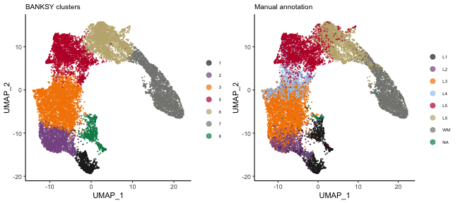
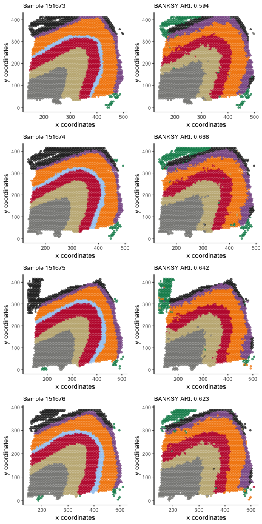

Here, we demonstrate BANKSY analysis on the human dorsolateral prefrontal 
cortex 10x Visium data from Maynard et al (2018). The data comprise 12 samples 
obtained from 3 subjects, with manual annotation of the layers in each sample. 
Here, we demonstrate BANKSY analysis on multiple datasets with 4 of the 12 
samples in this dataset. 

## Loading the data

The package provides gene expression and spot locations for the samples from 
subject 3 (sample 151673 - 151676). We processed the raw data (obtained 
[here](http://research.libd.org/spatialLIBD/)) by first performing library size 
normalization. Next, we identified the top 3000 highly variable genes for each 
sample. The union of these genes were used as the gene set for downstream 
analysis. See `?Banksy::dlpfc151673` for more details.

Here, we load the data and construct the *BanksyObject*.


```r
library(Banksy)
library(gridExtra)
library(ggplot2)

data(dlpfc151673)
data(dlpfc151674)
data(dlpfc151675)
data(dlpfc151676)

dlpfc <- list(dlpfc151673, dlpfc151674, dlpfc151675, dlpfc151676)

gcm <- lapply(dlpfc, function(x) x$expression)
locs <- lapply(dlpfc, function(x) x$locations)

names(gcm) <- names(locs) <- paste0('sample_15167', 3:6)
bank <- BanksyObject(own.expr = gcm, cell.locs = locs)

bank
```

```
## Object of class BanksyObject 
## Number of assays: 4
## sample_151673: 3639 cells 7319 features
## sample_151674: 3673 cells 7319 features
## sample_151675: 3592 cells 7319 features
## sample_151676: 3460 cells 7319 features
## Spatial dimensions:
## sample_151673: sdimx sdimy
## sample_151674: sdimx sdimy
## sample_151675: sdimx sdimy
## sample_151676: sdimx sdimy
## Metadata names: cell_ID dataset nCount NODG 
## Dimension reductions:
```

Each processed sample contains roughly ~3,500 spots and 7,319 genes.

## Running BANKSY

<details>
  <summary>**Note**</summary>
  
For brevity, the code chunks in this section are not run. The table below shows 
the expected run time and memory requirements for the following function calls:


|Function call | Elapsed time (sec)| Total RAM used (MiB)| Peaked RAM used (MiB)|
|:-------------|------------------:|--------------------:|---------------------:|
|ComputeBanksy |               8.14|                803.3|                2423.3|
|ScaleBanksy   |              14.42|                  0.1|                2621.0|
|RunPCA        |             299.67|                  6.0|                6002.2|
|ClusterBanksy |              18.81|                 32.9|                 380.4|

</details>

We run BANKSY by first computing the neighbor-augmented matrix. We use 
`k_geom=6`, which corresponds to the first order neighbors for 10x Visium data:


```r
bank <- ComputeBanksy(bank, k_geom = 6)
```

We use `lambda=0.2`, and compute 25 PCs on the scale BANKSY matrix:


```r
bank <- ScaleBanksy(bank)
bank <- RunBanksyPCA(bank, lambda = 0.2, npcs = 25)
```

Finally, we perform Leiden clustering on 25 PCs:


```r
set.seed(1000)
bank <- ClusterBanksy(bank, M=0, lambda = 0.2, pca = TRUE, npcs = 25,
                      k.neighbors = 40, resolution = 0.5)
```


## Assessing clustering output

To assess BANKSY clustering output, we load manual annotation for each sample 
and add it to the *BanksyObject*:


```r
library(plyr)

# Manual annotation is provided with the package
anno <- readRDS(system.file('extdata/dlpfc_annotation.rds', package = 'Banksy'))
layers <- c('L1','L2','L3','L4','L5','L6','WM','NA')
anno <-  as.numeric(mapvalues(anno, from = layers, to = 1:8))

# Add manual annotation the the BanksyObject
meta.data(bank)$clust_anno <- anno
```

Here, we visualise the UMAP for the spots from all samples combined, overlayed
with BANKSY clusters and manual annotation. 


```r
grid.arrange(
  plotReduction(bank, reduction = 'umap_M0_lam0.2', by = 'clust_M0_lam0.2_k40_res0.5', type = 'discrete',
                main = 'BANKSY clusters', main.size = 10, pt.size = 0.25), 
  plotReduction(bank, reduction = 'umap_M0_lam0.2', by = 'clust_anno', type = 'discrete',
                main = 'Manual annotation', main.size = 10, pt.size = 0.25) +
    scale_color_manual(labels = layers, values = Banksy:::getPalette(8)),
  ncol = 2
)
```

<div class="figure" style="text-align: center">

<p class="caption">plot of chunk umap</p>
</div>

Next, we compare BANKSY clusters against the manual annotation by computing the
adjusted Rand index for each sample and visualising the spatial plots:


```r
sample_names <- unique(meta.data(bank)$dataset)

# Get labels for each sample separately
sample_banksy <- split(meta.data(bank)$clust_M0_lam0.2_k40_res0.5, meta.data(bank)$dataset)
sample_anno <- split(meta.data(bank)$clust_anno, meta.data(bank)$dataset)

# Compute the ARI for each sample
sample_ari <- Map(function(x,y) round(mclust::adjustedRandIndex(x,y),3),
                  sample_banksy, sample_anno)

# Generate plots
sample_plots <- Map(function(x,y) {
    p1 <- plotSpatial(bank, dataset = x, by = 'clust_anno', type = 'discrete',
                main = sprintf('Sample %s', gsub('sample_', '', x)),
                main.size = 10, pt.size = 1, legend = FALSE)
    p2 <- plotSpatial(bank, dataset = x, by = 'clust_M0_lam0.2_k40_res0.5', type = 'discrete',
                main = sprintf('BANKSY ARI: %s', y),
                main.size = 10, pt.size = 1, legend = FALSE)
    list(p1, p2)
  },
  sample_names, sample_ari)
sample_plots <- unlist(sample_plots, recursive = FALSE)

grid.arrange(
  grobs = sample_plots, nrow = 4, ncol = 2, 
  layout_matrix = rbind(1:2,3:4,5:6,7:8)
)
```

<div class="figure" style="text-align: center">

<p class="caption">plot of chunk plot</p>
</div>

## Session information

<details>


```r
sessionInfo()
```

```
## R version 4.3.2 (2023-10-31)
## Platform: aarch64-apple-darwin20 (64-bit)
## Running under: macOS Sonoma 14.2.1
## 
## Matrix products: default
## BLAS:   /System/Library/Frameworks/Accelerate.framework/Versions/A/Frameworks/vecLib.framework/Versions/A/libBLAS.dylib 
## LAPACK: /Library/Frameworks/R.framework/Versions/4.3-arm64/Resources/lib/libRlapack.dylib;  LAPACK version 3.11.0
## 
## locale:
## [1] en_US.UTF-8/en_US.UTF-8/en_US.UTF-8/C/en_US.UTF-8/en_US.UTF-8
## 
## time zone: Europe/London
## tzcode source: internal
## 
## attached base packages:
## [1] stats     graphics  grDevices utils     datasets  methods   base     
## 
## other attached packages:
## [1] plyr_1.8.9    ggplot2_3.4.4 gridExtra_2.3 Banksy_0.1.6 
## 
## loaded via a namespace (and not attached):
##   [1] RColorBrewer_1.1-3          rstudioapi_0.15.0           shape_1.4.6                 magrittr_2.0.3             
##   [5] ggbeeswarm_0.7.2            magick_2.8.2                farver_2.1.1                rmarkdown_2.25             
##   [9] GlobalOptions_0.1.2         fs_1.6.3                    zlibbioc_1.48.0             vctrs_0.6.5                
##  [13] memoise_2.0.1               DelayedMatrixStats_1.24.0   RCurl_1.98-1.14             progress_1.2.3             
##  [17] htmltools_0.5.7             S4Arrays_1.2.0              usethis_2.2.2               BiocNeighbors_1.20.2       
##  [21] SparseArray_1.2.4           htmlwidgets_1.6.4           desc_1.4.3                  cachem_1.0.8               
##  [25] igraph_2.0.1.1              mime_0.12                   lifecycle_1.0.4             iterators_1.0.14           
##  [29] pkgconfig_2.0.3             rsvd_1.0.5                  Matrix_1.6-5                R6_2.5.1                   
##  [33] fastmap_1.1.1               GenomeInfoDbData_1.2.11     MatrixGenerics_1.14.0       shiny_1.8.0                
##  [37] aricode_1.0.3               clue_0.3-65                 digest_0.6.34               colorspace_2.1-0           
##  [41] S4Vectors_0.40.2            ps_1.7.6                    scater_1.30.1               irlba_2.3.5.1              
##  [45] pkgload_1.3.4               GenomicRanges_1.54.1        beachmat_2.18.0             labeling_0.4.3             
##  [49] sccore_1.0.4                fansi_1.0.6                 abind_1.4-5                 compiler_4.3.2             
##  [53] remotes_2.4.2.1             withr_3.0.0                 doParallel_1.0.17           BiocParallel_1.36.0        
##  [57] viridis_0.6.5               highr_0.10                  pkgbuild_1.4.3              maps_3.4.2                 
##  [61] DelayedArray_0.28.0         sessioninfo_1.2.2           rjson_0.2.21                tools_4.3.2                
##  [65] vipor_0.4.7                 beeswarm_0.4.0              httpuv_1.6.14               glue_1.7.0                 
##  [69] dbscan_1.1-12               callr_3.7.3                 promises_1.2.1              grid_4.3.2                 
##  [73] cluster_2.1.6               generics_0.1.3              gtable_0.3.4                hms_1.1.3                  
##  [77] data.table_1.15.0           BiocSingular_1.18.0         ScaledMatrix_1.10.0         utf8_1.2.4                 
##  [81] XVector_0.42.0              BiocGenerics_0.48.1         ggrepel_0.9.5               foreach_1.5.2              
##  [85] pillar_1.9.0                stringr_1.5.1               pals_1.8                    RcppHungarian_0.3          
##  [89] later_1.3.2                 circlize_0.4.15             dplyr_1.1.4                 lattice_0.22-5             
##  [93] tidyselect_1.2.0            ComplexHeatmap_2.18.0       SingleCellExperiment_1.24.0 miniUI_0.1.1.1             
##  [97] scuttle_1.12.0              knitr_1.45                  IRanges_2.36.0              SummarizedExperiment_1.32.0
## [101] stats4_4.3.2                xfun_0.42                   Biobase_2.62.0              devtools_2.4.5             
## [105] matrixStats_1.2.0           stringi_1.8.3               yaml_2.3.8                  evaluate_0.23              
## [109] codetools_0.2-19            tibble_3.2.1                cli_3.6.2                   uwot_0.1.16                
## [113] xtable_1.8-4                leidenAlg_1.1.2             munsell_0.5.0               processx_3.8.3             
## [117] dichromat_2.0-0.1           Rcpp_1.0.12                 GenomeInfoDb_1.38.6         mapproj_1.2.11             
## [121] png_0.1-8                   parallel_4.3.2              ellipsis_0.3.2              prettyunits_1.2.0          
## [125] ggalluvial_0.12.5           mclust_6.0.1                profvis_0.3.8               urlchecker_1.0.1           
## [129] sparseMatrixStats_1.14.0    bitops_1.0-7                SpatialExperiment_1.12.0    viridisLite_0.4.2          
## [133] scales_1.3.0                purrr_1.0.2                 crayon_1.5.2                GetoptLong_1.0.5           
## [137] rlang_1.1.3
```

</details>
