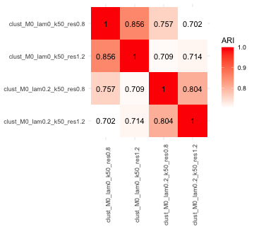
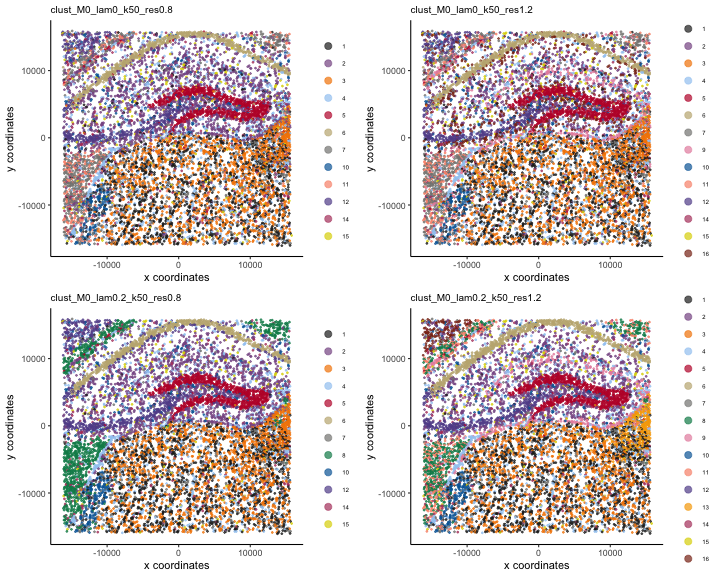
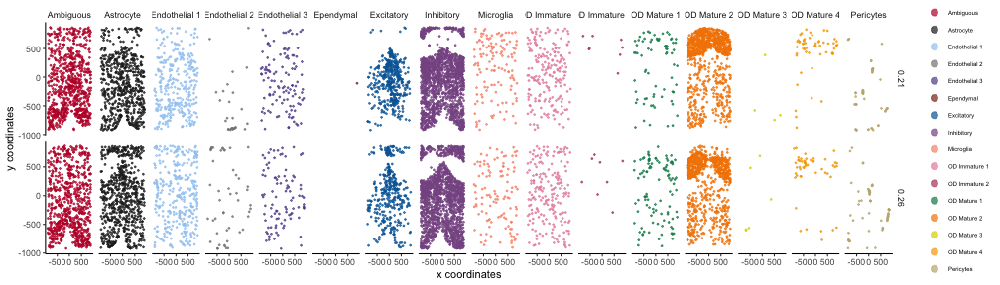
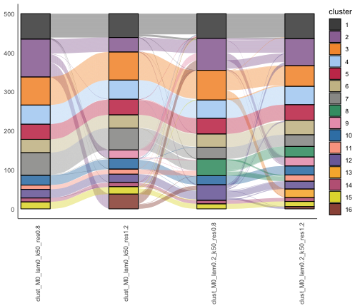

Here, we demonstrate a grid search of clustering parameters with a mouse 
hippocampus VeraFISH dataset. *BANKSY* currently provides four algorithms for 
clustering the BANKSY matrix with *ClusterBanksy*: Leiden (default), Louvain,
k-means, and model-based clustering. In this vignette, we run only Leiden 
clustering. See `?ClusterBanksy` for more details on the parameters for
different clustering methods.

## Loading the data

First, we construct the *BanksyObject*. The dataset comprises gene expression 
for 10,944 cells and 120 genes in 2 spatial dimensions. See 
`?Banksy::hippocampus` for more details.


```r
library(Banksy)
library(ggplot2)
library(gridExtra)

data(hippocampus)
expr <- hippocampus$expression
locs <- hippocampus$locations

# Store total counts and number of expressed genes
total_count <- colSums(expr)
num_genes <- colSums(expr > 0)
meta <- data.frame(total_count = total_count, num_genes = num_genes)

# Construct BanksyObject
bank <- BanksyObject(own.expr = expr, cell.locs = locs, meta.data = meta)
bank
#> Object of class BanksyObject 
#> Assay with 10994 cells 120 features
#> Spatial dimensions: sdimx sdimy 
#> Metadata names: cell_ID nCount NODG 
#> Dimension reductions:
```

## Parameters

The `lambda` parameter is a mixing parameter in `[0,1]` which 
determines how much spatial information is incorporated for clustering. With 
smaller values of `lambda` (e.g. `[0,0.25]`), BANKY operates in 
*cell-typing* mode, while at higher levels of `lambda`, BANKSY operates in 
*zone-finding* mode. See the pre-print for more details.

Leiden graph-based clustering admits two parameters: `k.neighbors` and 
`resolution`. `k.neighbors` determines the number of k nearest neighbors used to
construct the shared nearest neighbors graph. Leiden clustering is then 
performed on the resultant graph with resolution `resolution`.

We first process the data for clustering:


```r
bank <- SubsetBanksy(bank, metadata = total_count > quantile(total_count, 0.05) &
                                      total_count < quantile(total_count, 0.98))
bank <- NormalizeBanksy(bank)
bank <- ComputeBanksy(bank)
bank <- ScaleBanksy(bank)
```

## Grid search

Before clustering, we define a parameter space. Here, we'll explore different 
combinations of `lambda` and `resolution` while fixing `kneighbours`. We first
run PCA on the BANKSY matrix with 20 PCs for each `lambda`. Clustering is then
performed on the PCs (by default):


```r
lam <- c(0, 0.2)
res <- c(0.8, 1.2)
knbr <- 50

bank <- RunBanksyPCA(bank, lambda = lam, npcs = 20)
#> Running PCA for M=0 lambda=0
#> BANKSY matrix with own.expr, F0
#> Squared lambdas: 1, 0
#> Running PCA for M=0 lambda=0.2
#> BANKSY matrix with own.expr, F0
#> Squared lambdas: 0.8, 0.2
set.seed(42)
bank <- ClusterBanksy(bank, lambda = lam, pca = TRUE, npcs = 20, 
                      method = 'leiden', k.neighbors = knbr, resolution = res)
#> Using 1 core. Consider parallelising with the num.cores argument
#> 
 [=====================>---------------------]  50% eta:  3s
 [===============================>-----------]  75% eta:  4s
 [===========================================] 100% eta:  0s
```

This populates the `meta.data` slot of the *BanksyObject* with cluster labels
for each combination of parameters:


```r
head(meta.data(bank))
#>             cell_ID nCount NODG clust_M0_lam0_k50_res0.8 clust_M0_lam0_k50_res1.2 clust_M0_lam0.2_k50_res0.8
#> cell_1276 cell_1276    266   51                        8                       10                          7
#> cell_691   cell_691    132   36                        4                        3                          8
#> cell_396   cell_396     95   27                        1                        8                          7
#> cell_68     cell_68    579   72                        8                       10                          7
#> cell_6954 cell_6954    116   29                        7                        7                          9
#> cell_7074 cell_7074     28   17                        6                        6                          9
#>           clust_M0_lam0.2_k50_res1.2
#> cell_1276                         16
#> cell_691                           7
#> cell_396                          16
#> cell_68                           16
#> cell_6954                          6
#> cell_7074                          6
```

## Cluster similarity

To compare clustering labels from different parameter combinations, the package
implements the *getARI* and *plotARI* functions. These compute the adjusted 
Rand index (ARI) for all pairs of clusters to assess the similarity of 
clustering labels. Observe that clusters with the same `lambda` share more
similarity:


```r
getARI(bank)
#>                            clust_M0_lam0_k50_res0.8 clust_M0_lam0_k50_res1.2 clust_M0_lam0.2_k50_res0.8 clust_M0_lam0.2_k50_res1.2
#> clust_M0_lam0_k50_res0.8                      1.000                    0.856                      0.757                      0.702
#> clust_M0_lam0_k50_res1.2                      0.856                    1.000                      0.709                      0.714
#> clust_M0_lam0.2_k50_res0.8                    0.757                    0.709                      1.000                      0.804
#> clust_M0_lam0.2_k50_res1.2                    0.702                    0.714                      0.804                      1.000

plotARI(bank) 
```

<div class="figure" style="text-align: center">

<p class="caption">plot of chunk runari</p>
</div>

## Connecting clusters

To visually compare between clusters obtained with different combination of 
parameters (a parameter run), the package implements *ConnectClusters* which
performs a mapping to harmonise cluster labels between different parameter runs.


```r
bank <- ConnectClusters(bank, map.to = 'clust_M0_lam0.2_k50_res1.2')

head(meta.data(bank))
#>             cell_ID nCount NODG clust_M0_lam0_k50_res0.8 clust_M0_lam0_k50_res1.2 clust_M0_lam0.2_k50_res0.8
#> cell_1276 cell_1276    266   51                       12                       12                         12
#> cell_691   cell_691    132   36                        7                        7                          7
#> cell_396   cell_396     95   27                        2                       16                         12
#> cell_68     cell_68    579   72                       12                       12                         12
#> cell_6954 cell_6954    116   29                        6                        6                          6
#> cell_7074 cell_7074     28   17                        5                        5                          6
#>           clust_M0_lam0.2_k50_res1.2
#> cell_1276                         16
#> cell_691                           7
#> cell_396                          16
#> cell_68                           16
#> cell_6954                          6
#> cell_7074                          6
```

This updates the `meta.data` slot with new cluster labels that can be used for 
visualisation. We can visualise connected output as follows.

First, obtain cluster names:


```r
cnms <- clust.names(bank)
```

Then, visualise the cluster runs:


```r
plotSpatialFeatures(bank, by = cnms, type = rep('discrete', 4), 
                    nrow = 2, ncol = 2, main = cnms, main.size = 10)
```



We visualise the differences between clusters obtained with non-spatial 
clustering (`lam=0`) and BANKSY in cell-typing mode (`lam=0.3`) more finely by 
splitting the clusters with `wrap = TRUE`:


```r
p1 <- plotSpatial(bank, by = cnms[2], type = 'discrete', 
            main = cnms[2], main.size = 10, pt.size = 0.1, wrap = TRUE)

p2 <- plotSpatial(bank, by = cnms[4], type = 'discrete', 
            main = cnms[4], main.size = 10, pt.size = 0.1, wrap = TRUE)

grid.arrange(p1, p2, ncol = 2)
```

<div class="figure" style="text-align: center">

<p class="caption">plot of chunk wrap</p>
</div>

In addition, one can also visualise differences in the clustering labels with
alluvial plots:


```r
plotAlluvia(bank)
```

<div class="figure" style="text-align: center">

<p class="caption">plot of chunk alluv</p>
</div>

## Session information

<details>


```r
sessionInfo()
#> R version 4.3.2 (2023-10-31)
#> Platform: aarch64-apple-darwin20 (64-bit)
#> Running under: macOS Sonoma 14.2.1
#> 
#> Matrix products: default
#> BLAS:   /System/Library/Frameworks/Accelerate.framework/Versions/A/Frameworks/vecLib.framework/Versions/A/libBLAS.dylib 
#> LAPACK: /Library/Frameworks/R.framework/Versions/4.3-arm64/Resources/lib/libRlapack.dylib;  LAPACK version 3.11.0
#> 
#> locale:
#> [1] en_US.UTF-8/en_US.UTF-8/en_US.UTF-8/C/en_US.UTF-8/en_US.UTF-8
#> 
#> time zone: Europe/London
#> tzcode source: internal
#> 
#> attached base packages:
#> [1] stats     graphics  grDevices utils     datasets  methods   base     
#> 
#> other attached packages:
#> [1] plyr_1.8.9    ggplot2_3.4.4 gridExtra_2.3 Banksy_0.1.6 
#> 
#> loaded via a namespace (and not attached):
#>   [1] RColorBrewer_1.1-3          rstudioapi_0.15.0           shape_1.4.6                 magrittr_2.0.3             
#>   [5] ggbeeswarm_0.7.2            magick_2.8.2                farver_2.1.1                rmarkdown_2.25             
#>   [9] GlobalOptions_0.1.2         fs_1.6.3                    zlibbioc_1.48.0             vctrs_0.6.5                
#>  [13] memoise_2.0.1               DelayedMatrixStats_1.24.0   RCurl_1.98-1.14             progress_1.2.3             
#>  [17] htmltools_0.5.7             S4Arrays_1.2.0              usethis_2.2.2               BiocNeighbors_1.20.2       
#>  [21] SparseArray_1.2.4           htmlwidgets_1.6.4           desc_1.4.3                  cachem_1.0.8               
#>  [25] igraph_2.0.1.1              mime_0.12                   lifecycle_1.0.4             iterators_1.0.14           
#>  [29] pkgconfig_2.0.3             rsvd_1.0.5                  Matrix_1.6-5                R6_2.5.1                   
#>  [33] fastmap_1.1.1               GenomeInfoDbData_1.2.11     MatrixGenerics_1.14.0       shiny_1.8.0                
#>  [37] aricode_1.0.3               clue_0.3-65                 digest_0.6.34               colorspace_2.1-0           
#>  [41] S4Vectors_0.40.2            ps_1.7.6                    scater_1.30.1               irlba_2.3.5.1              
#>  [45] pkgload_1.3.4               GenomicRanges_1.54.1        beachmat_2.18.0             labeling_0.4.3             
#>  [49] sccore_1.0.4                fansi_1.0.6                 abind_1.4-5                 compiler_4.3.2             
#>  [53] remotes_2.4.2.1             withr_3.0.0                 doParallel_1.0.17           BiocParallel_1.36.0        
#>  [57] viridis_0.6.5               highr_0.10                  pkgbuild_1.4.3              maps_3.4.2                 
#>  [61] DelayedArray_0.28.0         sessioninfo_1.2.2           rjson_0.2.21                tools_4.3.2                
#>  [65] vipor_0.4.7                 beeswarm_0.4.0              httpuv_1.6.14               glue_1.7.0                 
#>  [69] dbscan_1.1-12               callr_3.7.3                 promises_1.2.1              grid_4.3.2                 
#>  [73] reshape2_1.4.4              cluster_2.1.6               generics_0.1.3              gtable_0.3.4               
#>  [77] tidyr_1.3.1                 hms_1.1.3                   data.table_1.15.0           BiocSingular_1.18.0        
#>  [81] ScaledMatrix_1.10.0         utf8_1.2.4                  XVector_0.42.0              BiocGenerics_0.48.1        
#>  [85] ggrepel_0.9.5               foreach_1.5.2               pillar_1.9.0                stringr_1.5.1              
#>  [89] pals_1.8                    RcppHungarian_0.3           later_1.3.2                 circlize_0.4.15            
#>  [93] dplyr_1.1.4                 lattice_0.22-5              tidyselect_1.2.0            ComplexHeatmap_2.18.0      
#>  [97] SingleCellExperiment_1.24.0 miniUI_0.1.1.1              scuttle_1.12.0              knitr_1.45                 
#> [101] IRanges_2.36.0              SummarizedExperiment_1.32.0 stats4_4.3.2                xfun_0.42                  
#> [105] Biobase_2.62.0              devtools_2.4.5              matrixStats_1.2.0           stringi_1.8.3              
#> [109] yaml_2.3.8                  evaluate_0.23               codetools_0.2-19            tibble_3.2.1               
#> [113] cli_3.6.2                   uwot_0.1.16                 xtable_1.8-4                leidenAlg_1.1.2            
#> [117] munsell_0.5.0               processx_3.8.3              dichromat_2.0-0.1           Rcpp_1.0.12                
#> [121] GenomeInfoDb_1.38.6         mapproj_1.2.11              png_0.1-8                   parallel_4.3.2             
#> [125] ellipsis_0.3.2              prettyunits_1.2.0           ggalluvial_0.12.5           mclust_6.0.1               
#> [129] profvis_0.3.8               urlchecker_1.0.1            sparseMatrixStats_1.14.0    bitops_1.0-7               
#> [133] SpatialExperiment_1.12.0    viridisLite_0.4.2           scales_1.3.0                purrr_1.0.2                
#> [137] crayon_1.5.2                GetoptLong_1.0.5            rlang_1.1.3
```

</details>

