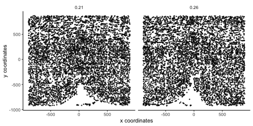
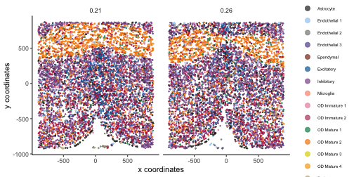
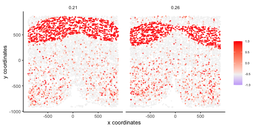
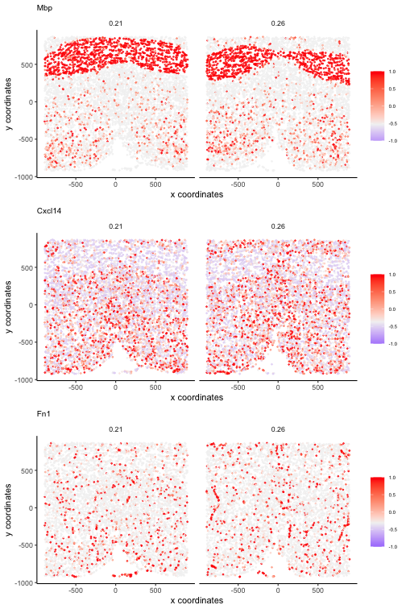
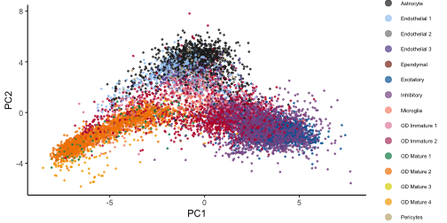
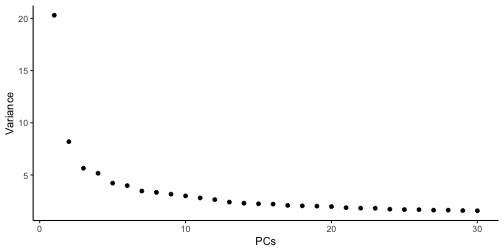
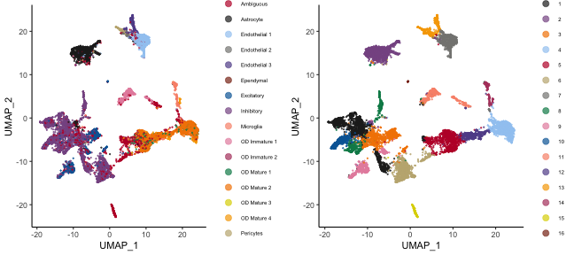
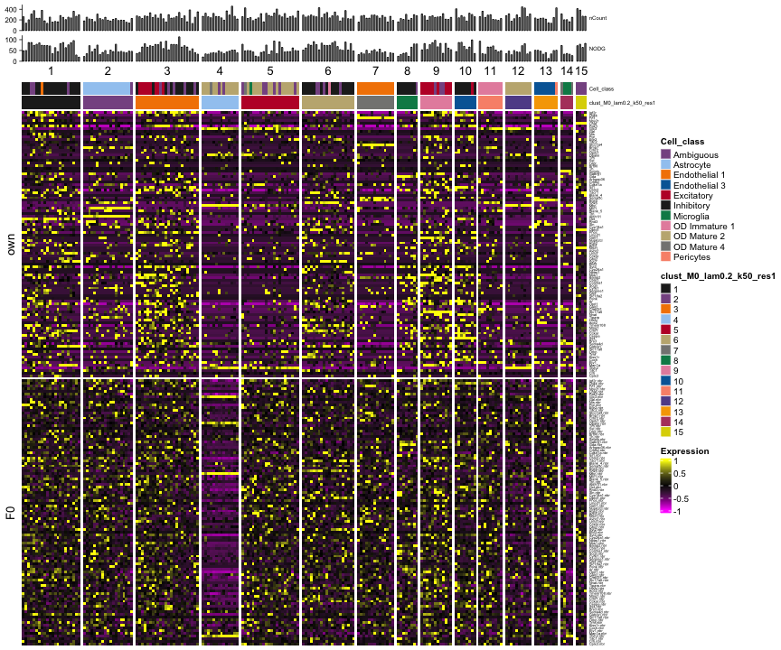

This article demonstrates functions for visualisation with a mouse hypothalamus
MERFISH dataset. The dataset comprises 11,162 cells and 161 genes in 3 spatial 
dimensions. Cell type annotation along with other metadata is provided. 


```r
library(Banksy)

data(hypothalamus)

# Initialize BanksyObject
expr <- hypothalamus$expression
locs <- hypothalamus$locations
meta <- hypothalamus$metadata

total_count <- colSums(expr)
meta <- cbind(meta, total_count = total_count)

bank <- BanksyObject(own.expr = expr,
                     cell.locs = locs,
                     meta.data = meta)

# Filter BanksyObject based on total count
bank <- SubsetBanksy(bank, metadata = total_count > quantile(total_count, 0.05))

bank
#> Object of class BanksyObject 
#> Assay with 10603 cells 161 features
#> Spatial dimensions: sdimx sdimy sdimz 
#> Metadata names: cell_ID nCount NODG Cell_name Cell_class Neuron_cluster_ID Animal_ID Animal_sex Behavior 
#> Dimension reductions:
```

Almost all plotting functions in *Banksy* return *ggplot* objects. They can thus
be further modified with the grammar of *ggplot*.

## Spatial plots

*Banksy* implements `plotSpatial` for visualising cells in spatial dimensions. 
For 3 dimensional datasets, it is assumed that the z-plane is
discretized. Spatial plots will be wrapped by z-plane. 


```r
plotSpatial(bank)
```

<div class="figure" style="text-align: center">

<p class="caption">plot of chunk spatial-1</p>
</div>

Cells can be colored by groups. Any column in the metadata and any feature 
(gene) can be used as a grouping variable.


```r
plotSpatial(bank, by = 'Cell_class', type = 'discrete')
```

<div class="figure" style="text-align: center">

<p class="caption">plot of chunk spatial-2</p>
</div>

Plots can be wrapped with `wrap=TRUE`:


```r
# Wrap to visualise each group in the grouping factor
plotSpatial(bank, by = 'Cell_class', type = 'discrete', wrap = TRUE)
```

<div class="figure" style="text-align: center">

<p class="caption">plot of chunk wrap</p>
</div>

Process the data:


```r
bank <- NormalizeBanksy(bank)
bank <- ComputeBanksy(bank)
#> Computing neighbors...
#> Spatial mode is kNN median
#> Parameters: k_geom = 15
#> Done
#> Computing harmonic m = 0
#> Using 15 neighbors
#> Done
bank <- ScaleBanksy(bank)
```

Visualise scaled *Mbp* expression, a marker for myelinating oligodendrocytes:


```r
plotSpatial(bank, by = 'Mbp', type = 'continuous', 
            col.lowpoint = -1, col.highpoint = 1)
```

<div class="figure" style="text-align: center">

<p class="caption">plot of chunk spatial-3</p>
</div>

Multiple features can be plotted simultaneously with `plotSpatialFeatures`:


```r
features <- c('Mbp', 'Cxcl14', 'Fn1')
type <- rep('continuous', 3)
plotSpatialFeatures(bank, by = features, type = type, 
                    col.lowpoint = -1, col.highpoint = 1, 
                    main = features, main.size = 10, nrow = 3)
```

<div class="figure" style="text-align: center">

<p class="caption">plot of chunk spatial-4</p>
</div>

## Dimensionality reduction 

*Banksy* provides functions for running and visualising principal component 
analysis (PCA) and uniform manifold approximation projection (UMAP) for 
dimensionality reduction.

We run PCA and UMAP, and visualise the results. A scree plot can be used to 
visualise the proportion of variance explained by each PC, and determine
how many PCs are used in downstream analyses.


```r
bank <- RunBanksyPCA(bank, lambda = 0.2, npcs = 30)
#> Running PCA for M=0 lambda=0.2
#> BANKSY matrix with own.expr, F0
#> Squared lambdas: 0.8, 0.2
plotReduction(bank, reduction = reduction.names(bank)[1], by = 'Cell_class', type = 'discrete')
```

<div class="figure" style="text-align: center">

<p class="caption">plot of chunk pca</p>
</div>

```r
plotScree(bank, lambda = 0.2)
```

<div class="figure" style="text-align: center">

<p class="caption">plot of chunk pca</p>
</div>

Next, we run UMAP and visualise the projection:


```r
bank <- RunBanksyUMAP(bank, lambda = 0.2, npcs = 20)
#> Computing UMAP with 20 PCs
#> Running UMAP for M=0 lambda=0.2
p1 <- plotReduction(bank, reduction = reduction.names(bank)[2], by = 'Cell_class', 
                    type = 'discrete', pt.size = 0.25)
```

Run BANKSY with Leiden clustering, and compare the clustering output with the
cell class annotation:


```r
bank <- ClusterBanksy(bank, lambda = 0.2, pca = TRUE, npcs = 20,
                      method = 'leiden', k.neighbors = 50, resolution = 1)
p2 <- plotReduction(bank, reduction = reduction.names(bank)[2], by = clust.names(bank), 
                    type = 'discrete', pt.size = 0.25)

gridExtra::grid.arrange(
    p1, p2, ncol = 2
)
```

<div class="figure" style="text-align: center">

<p class="caption">plot of chunk cluster</p>
</div>

## Heatmaps

We implement heatmap visualisation with the *ComplexHeatmap* package. The 
`assay` argument takes one of:

- `own.expr`: visualise the cell's own expression
- `nbr.expr`: visualises the neighborhood expression
- `banksy`: visualises combined own and neighbor expression weighted by `lambda`

We can introduce multiple cell annotations by setting `annotate=TRUE` and 
specifying `annotate.by`. 

Because expression matrices can be large, one can also specify the maximum 
number of columns that should be plotted with `max.cols`. This subsamples the
matrix to speed up plotting.


```r
set.seed(1000)
plotHeatmap(bank, assay = 'banksy', lambda = 0.2, 
            annotate = TRUE, 
            annotate.by = c('Cell_class', clust.names(bank)), 
            barplot.by = c('NODG', 'nCount'),
            order.by = clust.names(bank), 
            features = sample(rownames(own.expr(bank)), 100),
            max.cols = 200)
#> Warning in getAssay(bank, assay, dataset, lambda, M, cells, features): M not specified. Setting M=0
#> BANKSY matrix with own.expr, F0
#> Squared lambdas: 0.8, 0.2
#> Sampling 200
#> Keeping 1.89% of cells
#> Annotating
#> Adding barplots
```

<div class="figure" style="text-align: center">

<p class="caption">plot of chunk heatmap</p>
</div>

## Session information

<details>


```r
sessionInfo()
#> R version 4.3.2 (2023-10-31)
#> Platform: aarch64-apple-darwin20 (64-bit)
#> Running under: macOS Sonoma 14.2.1
#> 
#> Matrix products: default
#> BLAS:   /System/Library/Frameworks/Accelerate.framework/Versions/A/Frameworks/vecLib.framework/Versions/A/libBLAS.dylib 
#> LAPACK: /Library/Frameworks/R.framework/Versions/4.3-arm64/Resources/lib/libRlapack.dylib;  LAPACK version 3.11.0
#> 
#> locale:
#> [1] en_US.UTF-8/en_US.UTF-8/en_US.UTF-8/C/en_US.UTF-8/en_US.UTF-8
#> 
#> time zone: Europe/London
#> tzcode source: internal
#> 
#> attached base packages:
#> [1] stats     graphics  grDevices utils     datasets  methods   base     
#> 
#> other attached packages:
#> [1] plyr_1.8.9    ggplot2_3.4.4 gridExtra_2.3 Banksy_0.1.6 
#> 
#> loaded via a namespace (and not attached):
#>   [1] RColorBrewer_1.1-3          rstudioapi_0.15.0           shape_1.4.6                 magrittr_2.0.3             
#>   [5] ggbeeswarm_0.7.2            magick_2.8.2                farver_2.1.1                rmarkdown_2.25             
#>   [9] GlobalOptions_0.1.2         fs_1.6.3                    zlibbioc_1.48.0             vctrs_0.6.5                
#>  [13] Cairo_1.6-2                 memoise_2.0.1               DelayedMatrixStats_1.24.0   RCurl_1.98-1.14            
#>  [17] progress_1.2.3              htmltools_0.5.7             S4Arrays_1.2.0              usethis_2.2.2              
#>  [21] BiocNeighbors_1.20.2        SparseArray_1.2.4           htmlwidgets_1.6.4           desc_1.4.3                 
#>  [25] cachem_1.0.8                igraph_2.0.1.1              mime_0.12                   lifecycle_1.0.4            
#>  [29] iterators_1.0.14            pkgconfig_2.0.3             rsvd_1.0.5                  Matrix_1.6-5               
#>  [33] R6_2.5.1                    fastmap_1.1.1               GenomeInfoDbData_1.2.11     MatrixGenerics_1.14.0      
#>  [37] shiny_1.8.0                 aricode_1.0.3               clue_0.3-65                 digest_0.6.34              
#>  [41] colorspace_2.1-0            S4Vectors_0.40.2            ps_1.7.6                    scater_1.30.1              
#>  [45] irlba_2.3.5.1               pkgload_1.3.4               GenomicRanges_1.54.1        beachmat_2.18.0            
#>  [49] labeling_0.4.3              sccore_1.0.4                fansi_1.0.6                 abind_1.4-5                
#>  [53] compiler_4.3.2              remotes_2.4.2.1             withr_3.0.0                 doParallel_1.0.17          
#>  [57] BiocParallel_1.36.0         viridis_0.6.5               highr_0.10                  pkgbuild_1.4.3             
#>  [61] maps_3.4.2                  DelayedArray_0.28.0         sessioninfo_1.2.2           rjson_0.2.21               
#>  [65] tools_4.3.2                 vipor_0.4.7                 beeswarm_0.4.0              httpuv_1.6.14              
#>  [69] glue_1.7.0                  dbscan_1.1-12               callr_3.7.3                 promises_1.2.1             
#>  [73] grid_4.3.2                  reshape2_1.4.4              cluster_2.1.6               generics_0.1.3             
#>  [77] gtable_0.3.4                tidyr_1.3.1                 hms_1.1.3                   data.table_1.15.0          
#>  [81] BiocSingular_1.18.0         ScaledMatrix_1.10.0         utf8_1.2.4                  XVector_0.42.0             
#>  [85] RcppAnnoy_0.0.22            BiocGenerics_0.48.1         ggrepel_0.9.5               foreach_1.5.2              
#>  [89] pillar_1.9.0                stringr_1.5.1               pals_1.8                    RcppHungarian_0.3          
#>  [93] later_1.3.2                 circlize_0.4.15             dplyr_1.1.4                 lattice_0.22-5             
#>  [97] tidyselect_1.2.0            ComplexHeatmap_2.18.0       SingleCellExperiment_1.24.0 miniUI_0.1.1.1             
#> [101] scuttle_1.12.0              knitr_1.45                  IRanges_2.36.0              SummarizedExperiment_1.32.0
#> [105] stats4_4.3.2                xfun_0.42                   Biobase_2.62.0              devtools_2.4.5             
#> [109] matrixStats_1.2.0           stringi_1.8.3               yaml_2.3.8                  evaluate_0.23              
#> [113] codetools_0.2-19            tibble_3.2.1                cli_3.6.2                   uwot_0.1.16                
#> [117] xtable_1.8-4                leidenAlg_1.1.2             munsell_0.5.0               processx_3.8.3             
#> [121] dichromat_2.0-0.1           Rcpp_1.0.12                 GenomeInfoDb_1.38.6         mapproj_1.2.11             
#> [125] png_0.1-8                   parallel_4.3.2              ellipsis_0.3.2              prettyunits_1.2.0          
#> [129] ggalluvial_0.12.5           mclust_6.0.1                profvis_0.3.8               urlchecker_1.0.1           
#> [133] sparseMatrixStats_1.14.0    bitops_1.0-7                SpatialExperiment_1.12.0    viridisLite_0.4.2          
#> [137] scales_1.3.0                purrr_1.0.2                 crayon_1.5.2                GetoptLong_1.0.5           
#> [141] rlang_1.1.3
```

</details>

