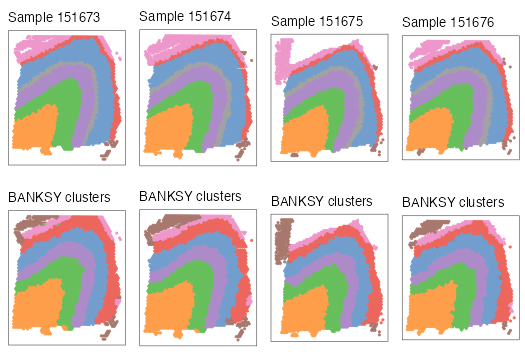
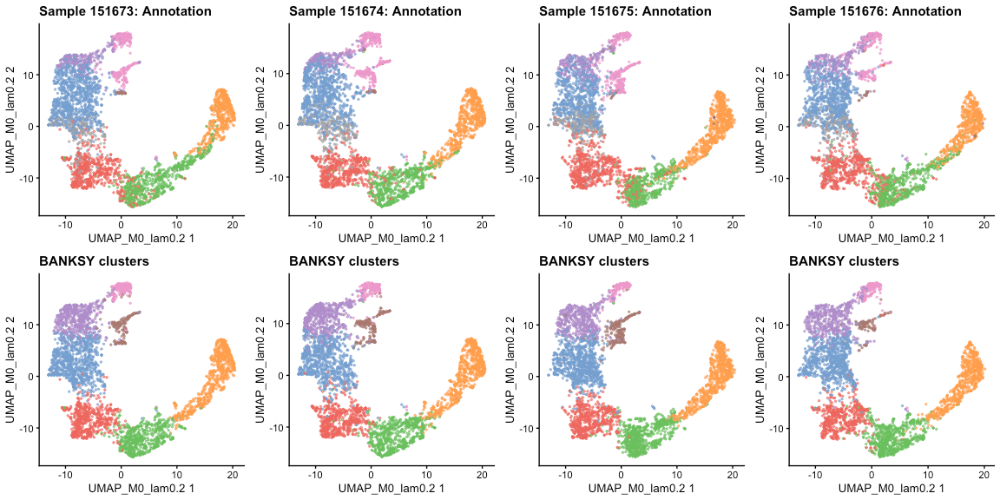

```{r, include = FALSE}
knitr::opts_chunk$set(
    collapse = TRUE,
    comment = "#>",
    fig.path = "figures/"
)
```

Here, we demonstrate BANKSY analysis on 10x Visium data of the human 
dorsolateral prefrontal cortex from Maynard et al (2018). The data comprise 12 
samples obtained from 3 subjects, with manual annotation of the layers in each 
sample. We will focus on 4 of the 12 samples from subject 3, demonstrating 
multi-sample analysis with BANKSY.

```{r, eval=FALSE, message=FALSE, warning=FALSE}
library(Banksy)
library(SummarizedExperiment)
library(SpatialExperiment)

library(scater)
library(cowplot)
library(ggplot2)
library(ggspavis)
```

## Loading the data

We fetch the data for all 12 DLPFC samples with the [*spatialLIBD*](https://bioconductor.org/packages/release/data/experiment/html/spatialLIBD.html) 
package. This might take awhile.

```{r, eval=FALSE}
library(spatialLIBD)
library(ExperimentHub)

ehub <- ExperimentHub::ExperimentHub()
spe <- spatialLIBD::fetch_data(type = "spe", eh = ehub)
```

After the download is completed, we trim the *SpatialExperiment* object, 
retaining only the counts and some metadata such as the sample identifier and 
pathology annotations. This saves some memory.

```{r, eval=FALSE}
imgData(spe) <- NULL
assay(spe, "logcounts") <- NULL
reducedDims(spe) <- NULL
rowData(spe) <- NULL
colData(spe) <- DataFrame(
    sample_id = spe$sample_id,
    clust_annotation = factor(
        addNA(spe$layer_guess_reordered_short),
        exclude = NULL, labels = seq(8)
    ),
    in_tissue = spe$in_tissue,
    row.names = colnames(spe)
)
gc()
```

Next, subset `spe` to samples from the last subject (samples `151673`, 
`151674`, `151675`, `151676`). This stores each sample in its own 
*SpatialExperiment* object, all placed in a list.

```{r, eval=FALSE}
sample_names <- as.character(151673:151676)
spe_list <- lapply(sample_names, function(x) spe[, spe$sample_id == x])
rm(spe)
gc()
```

## Data preprocessing

Using the [*singleCellTK*](https://bioconductor.org/packages/release/bioc/html/singleCellTK.html) 
package, we perform basic normalisation of the data:

```{r, eval=FALSE}
library(singleCellTK)
aname <- "normcounts"
spe_list <- lapply(spe_list, function(x) {
    singleCellTK::runSeuratNormalizeData(
        x,
        useAssay = "counts",
        normAssayName = aname,
        normalizationMethod = "RC",
        scaleFactor = 5000,
        verbose = FALSE
    )
})
```

Next, select the top 2000 highly variable features from each sample, and take
their union for downstream analysis:

```{r, eval=FALSE}
hvgs <- lapply(spe_list, function(x) {
    singleCellTK::getTopHVG(
        singleCellTK::runSeuratFindHVG(x, hvgNumber = 2000, verbose = FALSE),
        hvgNumber = 2000
    )
})
hvgs <- Reduce(union, hvgs)
# Subset to hvgs
spe_list <- lapply(spe_list, function(x) x[hvgs, ])
```

## Running BANKSY

To run BANKSY across multiple samples, we first compute the BANKSY neighborhood
feature matrices for each sample separately. We use `k_geom=6` corresponding to
the first-order neighbors in 10x Visium assays (`k_geom=18` corresponding to 
first and second-order neighbors may also be used).

```{r, eval=FALSE}
compute_agf <- FALSE
k_geom <- 6
spe_list <- lapply(spe_list, computeBanksy, assay_name = aname, compute_agf = compute_agf, k_geom = k_geom)
```

We then merge the samples to perform joint dimensional reduction and 
clustering:

```{r, eval=FALSE}
spe_joint <- do.call(cbind, spe_list)
rm(spe_list)
gc()
```

When running multi-sample BANKSY PCA, the `group` argument may be provided. 
This specifies the grouping variable for the cells or spots across the samples.
Features belonging to cells or spots corresponding to each level of the 
grouping variable will be z-scaled separately. In this case, `sample_id` in 
`colData(spe_joint)` gives the grouping based on the sample of origin.

```{r, eval=FALSE}
lambda <- 0.2
use_agf <- FALSE
spe_joint <- runBanksyPCA(spe_joint, use_agf = use_agf, lambda = lambda, group = "sample_id", seed = 1000)
```

Run UMAP on the BANKSY embedding:

```{r, eval=FALSE}
spe_joint <- runBanksyUMAP(spe_joint, use_agf = use_agf, lambda = lambda, seed = 1000)
```

Finally, obtain cluster labels for spots across all 4 samples. 

```{r, eval=FALSE}
res <- 0.6
spe_joint <- clusterBanksy(spe_joint, use_agf = use_agf, lambda = lambda, resolution = res, seed = 1000)
cnm <- sprintf("clust_M%s_lam%s_k50_res%s", as.numeric(use_agf), lambda, res)
```

To compare clusters visually in the next section, run `connectClusters`:

```{r, eval=FALSE}
spe_joint <- connectClusters(spe_joint)
```

Once joint clustering is performed, we split the samples into their own
`SpatialExperiment` objects:

```{r, eval=FALSE}
spe_list <- lapply(sample_names, function(x) spe_joint[, spe_joint$sample_id == x])
rm(spe_joint)
gc()
```

As an optional step, we smooth the cluster labels of each sample separately. 
This can be done if smooth spatial domains are expected in the biological 
sample or tissue in question.

```{r, eval=FALSE}
spe_list <- lapply(spe_list, smoothLabels, cluster_names = cnm, k = 6L, verbose = FALSE)
names(spe_list) <- paste0("sample_", sample_names)
```

## Parsing BANKSY output

We can compare BANKSY clusters to pathology annotations using several cluster
comparison measures such as the adjusted Rand index (ARI) or normalized mutual
information (NMI) with `compareClusters`. 

```{r, eval=FALSE}
ari <- sapply(spe_list, function(x) as.numeric(tail(compareClusters(x, func = "ARI")[, 1], n = 1)))
```

```{r, eval=FALSE}
nmi <- sapply(spe_list, function(x) as.numeric(tail(compareClusters(x, func = "NMI")[, 1], n = 1)))
```

Visualise pathology annotation and BANKSY cluster on spatial coordinates with 
the [*ggspavis*](https://bioconductor.org/packages/ggspavis) package:

```{r multi-sample-spatial, eval=FALSE, fig.height=6, fig.width=12, fig.align='center'}
# Use scater:::.get_palette('tableau10medium')
pal <- c(
    "#729ECE", "#FF9E4A", "#67BF5C", "#ED665D", "#AD8BC9",
    "#A8786E", "#ED97CA", "#A2A2A2", "#CDCC5D", "#6DCCDA"
)

plot_bank <- lapply(spe_list, function(x) {
    plotSpots(x, annotate = sprintf("%s_smooth", cnm), size = 0.8, palette = pal) +
        theme(legend.position = "none") +
        labs(title = "BANKSY clusters")
})

plot_anno <- lapply(spe_list, function(x) {
    plotSpots(x, annotate = "clust_annotation", size = 0.8, palette = pal) +
        theme(legend.position = "none") +
        labs(title = sprintf("Sample %s: Annotation", x$sample_id[1]))
})

plot_list <- c(plot_anno, plot_bank)

plot_grid(plotlist = plot_list, ncol = 4, byrow = TRUE)
```

<center>

</center>

Visualize joint UMAPs for each sample:

```{r multi-sample-umap, eval=FALSE, fig.height=6, fig.width=12, fig.align='center'}
umap_bank <- lapply(spe_list, function(x) {
    plotReducedDim(x,
        "UMAP_M0_lam0.2",
        colour_by = sprintf("%s_smooth", cnm),
        point_size = 0.5
    ) +
        theme(legend.position = "none") +
        labs(title = "BANKSY clusters")
})

umap_anno <- lapply(spe_list, function(x) {
    plotReducedDim(x,
        "UMAP_M0_lam0.2",
        colour_by = "clust_annotation",
        point_size = 0.5
    ) +
        theme(legend.position = "none") +
        labs(title = sprintf("Sample %s: Annotation", x$sample_id[1]))
})

umap_list <- c(umap_anno, umap_bank)

plot_grid(plotlist = umap_list, ncol = 4, byrow = TRUE)
```

<center>

</center>
