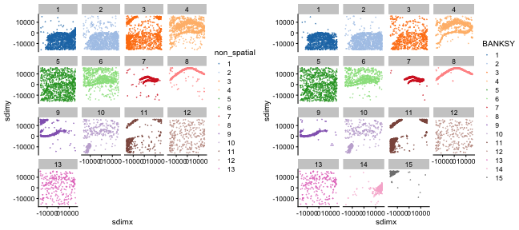
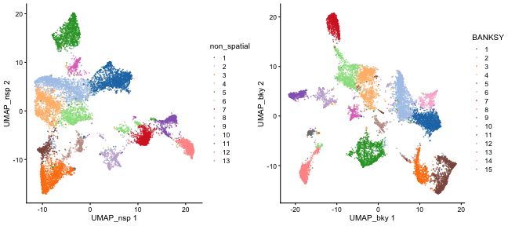

Here, we demonstrate interoperability between *Banksy* and 
*SingleCellExperiment* with a mouse VeraFISH dataset.  

## Loading the data

The dataset comprises gene expression for 10,944 cells and 120 genes in 2 
spatial dimensions. See `?Banksy::hippocampus` for more details. We load 
*Bioconductor* packages for single-cell analyses, *scater* and *scran*, and
create the *SingleCellExperiment* object. 


```r
library(Banksy)
library(scater)
library(scran)
library(gridExtra)

data(hippocampus)

# Create SCE
sce <- SingleCellExperiment(
    assays = list(counts = hippocampus$expression), 
    colData = hippocampus$locations)
sce <- scater::logNormCounts(sce)
```

## Running BANKSY

We convert the *SingleCellExperiment* object to a *BanksyObject*, and run the
BANKSY pipeline. In summary, we run BANKSY with `lam=0` corresponding to 
non-spatial clustering, and `lam=0.2` which incorporates spatial information. 
We compute 20 PCs, construct a shared nearest neighbor graph and cluster the
graph with Leiden clustering. 


```r
# Convert to BanksyObject
bank <- asBanksyObject(sce, expr.assay = 'counts', 
                       coord.colnames = c('sdimx', 'sdimy'))
# Run pipeline
bank <- NormalizeBanksy(bank)
bank <- ComputeBanksy(bank)
#> Computing neighbors...
#> Spatial mode is kNN median
#> Parameters: k_geom = 15
#> Done
#> Computing harmonic m = 0
#> Using 15 neighbors
#> Done
bank <- ScaleBanksy(bank)
bank <- RunBanksyPCA(bank, lambda = c(0,0.2), npcs = 20)
#> Running PCA for M=0 lambda=0
#> BANKSY matrix with own.expr, F0
#> Squared lambdas: 1, 0
#> Running PCA for M=0 lambda=0.2
#> BANKSY matrix with own.expr, F0
#> Squared lambdas: 0.8, 0.2
bank <- RunBanksyUMAP(bank, lambda = c(0,0.2), pca = TRUE, npcs = 20)
#> Computing UMAP with 20 PCs
#> Running UMAP for M=0 lambda=0
#> Computing UMAP with 20 PCs
#> Running UMAP for M=0 lambda=0.2
set.seed(42)
bank <- ClusterBanksy(bank, lambda = c(0,0.2), npcs = 20, 
                      method = 'leiden', k.neighbors = 50, resolution = 1)
#> 
#>  [===========================================] 100% eta:  0s
bank <- ConnectClusters(bank, map.to = clust.names(bank)[1])
```

## Appending BANKSY output

Output from the BANKSY run can be added to the original *SingleCellExperiment*
object. Here, we add the cluster labels and the PCA and UMAP cell embeddings. 


```r
# Add data to SCE
sce$non_spatial <- factor(meta.data(bank)$clust_M0_lam0_k50_res1)
sce$BANKSY <- factor(meta.data(bank)$clust_M0_lam0.2_k50_res1)
reducedDims(sce) <- list(UMAP_nsp = reduction(bank)$umap_M0_lam0,
                         UMAP_bky = reduction(bank)$umap_M0_lam0.2,
                         PCA_nsp = reduction(bank)$pca_M0_lam0$x,
                         PCA_bky = reduction(bank)$pca_M0_lam0.2$x)
```

Visualise the cells in UMAP and spatial dimensions:


```r
grid.arrange(
    plotColData(sce, x = 'sdimx', y = 'sdimy', colour_by = 'non_spatial',
                point_size = 0.05) + facet_wrap(~ colour_by),
    plotColData(sce, x = 'sdimx', y = 'sdimy', colour_by = 'BANKSY',
                point_size = 0.05) + facet_wrap(~ colour_by),
    ncol = 2)
```

<div class="figure" style="text-align: center">

<p class="caption">plot of chunk unnamed-chunk-5</p>
</div>

```r
grid.arrange(
    plotReducedDim(sce, dimred = 'UMAP_nsp', colour_by = 'non_spatial', 
                   point_size = 0.05),
    plotReducedDim(sce, dimred = 'UMAP_bky', colour_by = 'BANKSY', 
                   point_size = 0.05),
    ncol = 2)
```

<div class="figure" style="text-align: center">

<p class="caption">plot of chunk unnamed-chunk-5</p>
</div>

We can find markers for each BANKSY cluster with *scran*:


```r
colLabels(sce) <- sce$BANKSY
marker.info <- scoreMarkers(sce, colLabels(sce))
features <- sapply(marker.info, function(m) {
    m <- m[order(m$mean.AUC, decreasing = TRUE),]
    head(rownames(m), n = 1)
})
plotExpression(sce, features = features, x = 'BANKSY', colour_by = 'BANKSY',
               point_size = 0.1, ncol = 3)

```

## Session information

<details>


```r
sessionInfo()
#> R version 4.3.2 (2023-10-31)
#> Platform: aarch64-apple-darwin20 (64-bit)
#> Running under: macOS Sonoma 14.2.1
#> 
#> Matrix products: default
#> BLAS:   /System/Library/Frameworks/Accelerate.framework/Versions/A/Frameworks/vecLib.framework/Versions/A/libBLAS.dylib 
#> LAPACK: /Library/Frameworks/R.framework/Versions/4.3-arm64/Resources/lib/libRlapack.dylib;  LAPACK version 3.11.0
#> 
#> locale:
#> [1] en_US.UTF-8/en_US.UTF-8/en_US.UTF-8/C/en_US.UTF-8/en_US.UTF-8
#> 
#> time zone: Europe/London
#> tzcode source: internal
#> 
#> attached base packages:
#> [1] stats4    stats     graphics  grDevices utils     datasets  methods   base     
#> 
#> other attached packages:
#>  [1] scran_1.30.2                scater_1.30.1               scuttle_1.12.0              SingleCellExperiment_1.24.0
#>  [5] SummarizedExperiment_1.32.0 Biobase_2.62.0              GenomicRanges_1.54.1        GenomeInfoDb_1.38.6        
#>  [9] IRanges_2.36.0              S4Vectors_0.40.2            BiocGenerics_0.48.1         MatrixGenerics_1.14.0      
#> [13] matrixStats_1.2.0           plyr_1.8.9                  ggplot2_3.4.4               gridExtra_2.3              
#> [17] Banksy_0.1.6               
#> 
#> loaded via a namespace (and not attached):
#>   [1] RcppHungarian_0.3         RcppAnnoy_0.0.22          later_1.3.2               bitops_1.0-7             
#>   [5] tibble_3.2.1              lifecycle_1.0.4           aricode_1.0.3             edgeR_4.0.15             
#>   [9] doParallel_1.0.17         processx_3.8.3            lattice_0.22-5            pals_1.8                 
#>  [13] magrittr_2.0.3            limma_3.58.1              rmarkdown_2.25            yaml_2.3.8               
#>  [17] remotes_2.4.2.1           metapod_1.10.1            httpuv_1.6.14             sessioninfo_1.2.2        
#>  [21] pkgbuild_1.4.3            cowplot_1.1.3             mapproj_1.2.11            RColorBrewer_1.1-3       
#>  [25] maps_3.4.2                abind_1.4-5               pkgload_1.3.4             zlibbioc_1.48.0          
#>  [29] purrr_1.0.2               RCurl_1.98-1.14           circlize_0.4.15           GenomeInfoDbData_1.2.11  
#>  [33] ggrepel_0.9.5             irlba_2.3.5.1             dqrng_0.3.2               DelayedMatrixStats_1.24.0
#>  [37] codetools_0.2-19          DelayedArray_0.28.0       tidyselect_1.2.0          shape_1.4.6              
#>  [41] farver_2.1.1              ScaledMatrix_1.10.0       viridis_0.6.5             GetoptLong_1.0.5         
#>  [45] BiocNeighbors_1.20.2      ellipsis_0.3.2            ggalluvial_0.12.5         iterators_1.0.14         
#>  [49] foreach_1.5.2             dbscan_1.1-12             tools_4.3.2               progress_1.2.3           
#>  [53] Rcpp_1.0.12               glue_1.7.0                SparseArray_1.2.4         xfun_0.42                
#>  [57] usethis_2.2.2             dplyr_1.1.4               withr_3.0.0               fastmap_1.1.1            
#>  [61] bluster_1.12.0            fansi_1.0.6               callr_3.7.3               digest_0.6.34            
#>  [65] rsvd_1.0.5                R6_2.5.1                  mime_0.12                 colorspace_2.1-0         
#>  [69] Cairo_1.6-2               sccore_1.0.4              dichromat_2.0-0.1         utf8_1.2.4               
#>  [73] tidyr_1.3.1               generics_0.1.3            data.table_1.15.0         prettyunits_1.2.0        
#>  [77] htmlwidgets_1.6.4         S4Arrays_1.2.0            uwot_0.1.16               pkgconfig_2.0.3          
#>  [81] gtable_0.3.4              ComplexHeatmap_2.18.0     XVector_0.42.0            htmltools_0.5.7          
#>  [85] profvis_0.3.8             clue_0.3-65               scales_1.3.0              png_0.1-8                
#>  [89] SpatialExperiment_1.12.0  knitr_1.45                rstudioapi_0.15.0         reshape2_1.4.4           
#>  [93] rjson_0.2.21              cachem_1.0.8              GlobalOptions_0.1.2       stringr_1.5.1            
#>  [97] parallel_4.3.2            miniUI_0.1.1.1            vipor_0.4.7               desc_1.4.3               
#> [101] pillar_1.9.0              grid_4.3.2                vctrs_0.6.5               urlchecker_1.0.1         
#> [105] promises_1.2.1            BiocSingular_1.18.0       beachmat_2.18.0           xtable_1.8-4             
#> [109] cluster_2.1.6             beeswarm_0.4.0            evaluate_0.23             magick_2.8.2             
#> [113] cli_3.6.2                 locfit_1.5-9.8            compiler_4.3.2            rlang_1.1.3              
#> [117] crayon_1.5.2              labeling_0.4.3            mclust_6.0.1              ps_1.7.6                 
#> [121] fs_1.6.3                  ggbeeswarm_0.7.2          stringi_1.8.3             viridisLite_0.4.2        
#> [125] BiocParallel_1.36.0       munsell_0.5.0             devtools_2.4.5            Matrix_1.6-5             
#> [129] hms_1.1.3                 sparseMatrixStats_1.14.0  statmod_1.5.0             shiny_1.8.0              
#> [133] highr_0.10                leidenAlg_1.1.2           igraph_2.0.1.1            memoise_2.0.1
```

</details>
